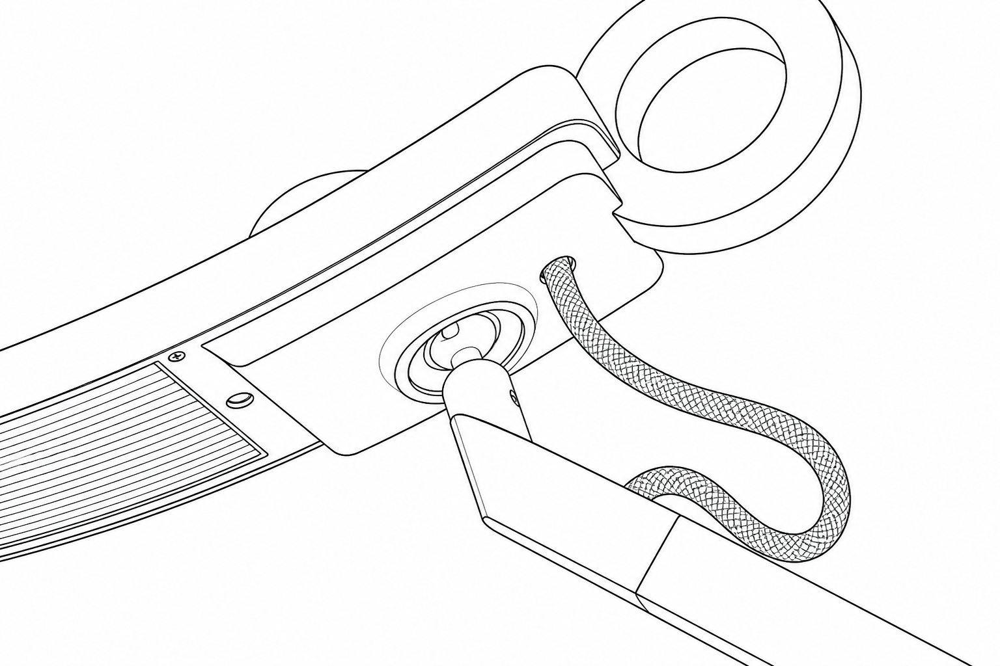
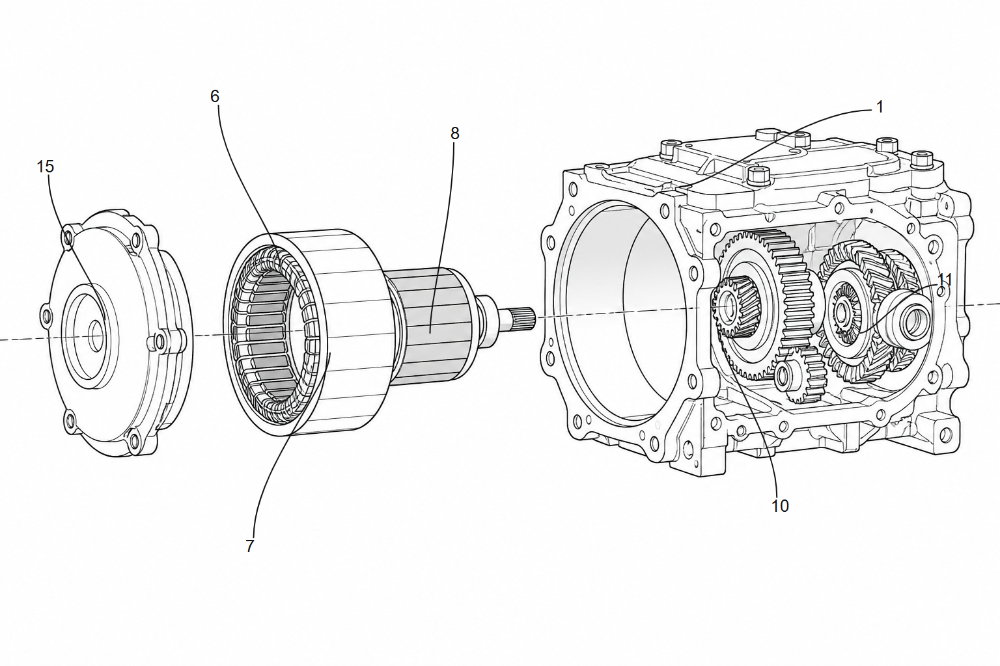
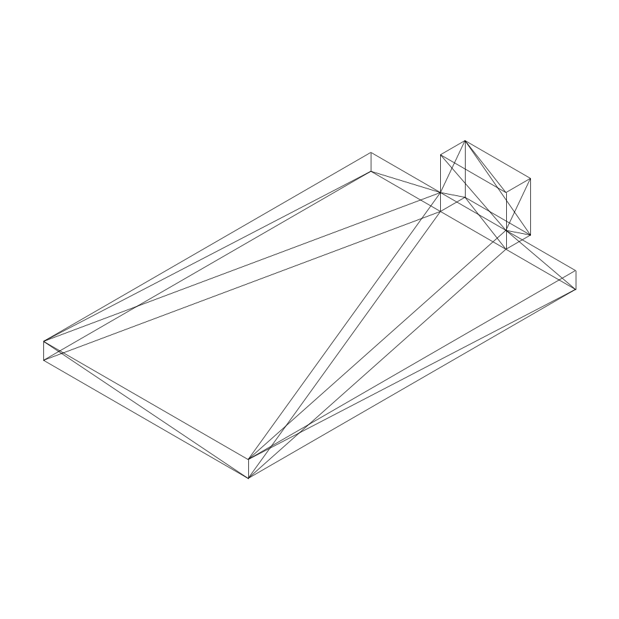
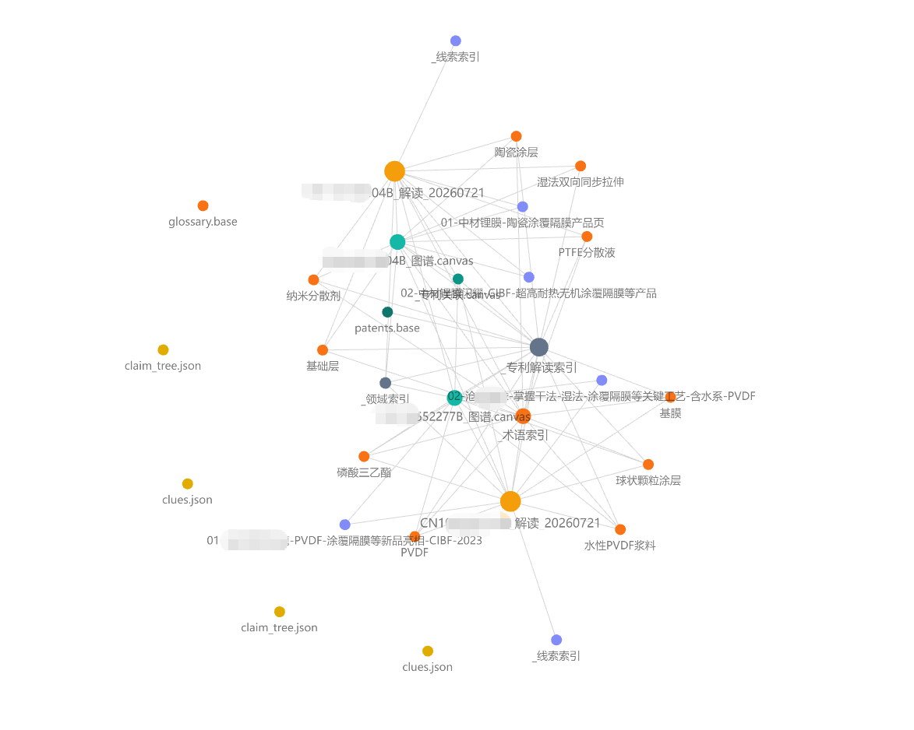
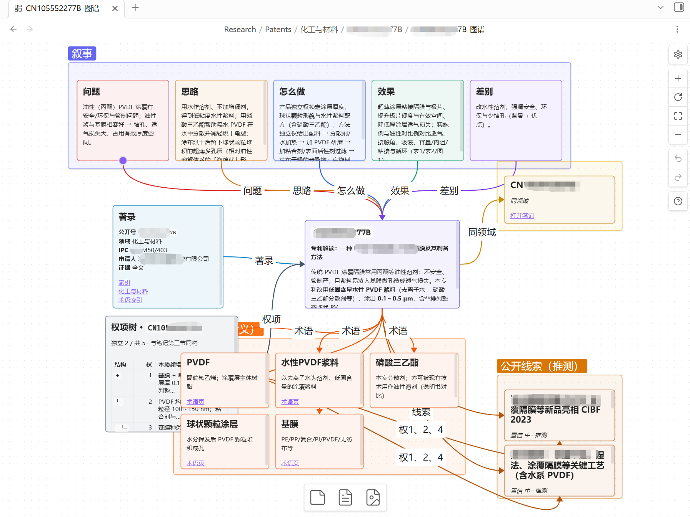

# 中国专利.skill

> 专利点挖掘与交底书（发明/实用/外观）编写，已有交底改写成申请文件，公布公告著录检索，通俗解读专利，对照审查口径出政策简报，辅助审查答复。

 

有设计文档和代码，但**专利点还没梳**？交底书要**框图 + 可改 Word**？ 
定稿后还要**多轮补材料、纠错**并留下修改追溯？ 
公开专利晦涩难懂，想**快速看懂权要与落地语境**？

[初衷](#初衷) · [运行效果](#运行效果) · [子技能列表](#子技能列表) · [支持作者](#支持作者) · [参考文档](#参考文档) · [安装说明](INSTALL.md) · [技能入口](SKILL.md)

---

## 初衷

### 专利交底书编写

> **做了多年核心研发，专利发明人那一栏从没写过我的名字。**

代码是自己敲的，方案是自己扛的，轮到交底书却卡在「专利点怎么挖、查新怎么写、框图和 Word 怎么一次交得出去」。本技能把这一环打通：覆盖发明 / 实用新型 / 外观设计，结构图与外观图都能读懂、写进交底；从项目材料梳出可申请的点，查新、脱敏、成文、迭代另存——让真正干活的人，也能把技术贡献写进可交付的交底书里。

### 专利通俗解读

> **不止一篇。**

公开专利常把阅读门槛抬得很高：权要绕、术语密、落地语境散落在说明书与附图里。本技能把单篇读成通俗笔记与图谱，并入库 Obsidian；依托双链、图谱、插件与 Bases 等生态，陆续解读的专利可以沉淀成**只属于自己的私有专利知识库**——权要、术语、线索与附图彼此勾连，越读越厚。再叠上 [Obsidian CLI](https://help.obsidian.md/cli) 与库内外连接能力，检索、批处理、和外部工具接力都更容易：从单篇通俗笔记，走向可检索、可关联、可继续生长的个人专利情报层，把沉睡在 PDF 里的技术细节重新点亮。库厚了之后，还能在这层之上做**专利比对、挖掘与分析**——同族对照、技术路线梳理、差异点扫描，把「读懂」推进到「用起来」。

---

## 运行效果

### 专利交底书编写

<table width="100%" border="1" cellpadding="12" cellspacing="0">
<tr>
<th width="50%" align="center">初版生成 首次落盘交付</th>
<th width="50%" align="center">迭代更新 多版本并存 + 对话记录</th>
</tr>
<tr>
<td width="50%" valign="top" align="center">

</td>
<td width="50%" valign="top" align="center">

</td>
</tr>
</table>

### 实用新型 / 外观 · 看图与出图

<table width="100%" border="1" cellpadding="12" cellspacing="0">
<tr>
<th width="33%" align="center">外观线稿 从产品图自动提炼造型轮廓</th>
<th width="33%" align="center">实用新型线稿 从结构图自动生成轮廓与部件序号引出</th>
<th width="34%" align="center">CAD 三维模型投影 从工程模型自动提取等轴测等多视角</th>
</tr>
<tr>
<td width="33%" valign="top" align="center">

</td>
<td width="33%" valign="top" align="center">

</td>
<td width="34%" valign="top" align="center">

</td>
</tr>
</table>

### 专利通俗解读

<table width="100%" border="1" cellpadding="12" cellspacing="0">
<tr>
<th width="50%" align="center">Obsidian 关系图 知识图谱与多色节点</th>
<th width="50%" align="center">解读 Canvas 叙事故事线 · 术语 · 公开线索</th>
</tr>
<tr>
<td width="50%" valign="top" align="center">

</td>
<td width="50%" valign="top" align="center">

</td>
</tr>
</table>

---

## 子技能列表

<!-- 使用 HTML 表格：避免 GitHub 管道表把左列挤窄 -->
<table>
<colgroup>
<col width="1%">
<col width="1%">
<col>
<col>
<col width="1%">
</colgroup>
<thead>
<tr>
<th align="left" nowrap width="1%">技能</th>
<th align="left" nowrap width="1%">名称</th>
<th align="left">能力</th>
<th align="left">触发</th>
<th align="left" nowrap width="1%">详情</th>
</tr>
</thead>
<tbody>
<tr>
<td nowrap width="1%"><a href="skills/patent-disclosure/README.md"><code>patent-disclosure</code></a></td>
<td nowrap width="1%">交底书编写</td>
<td>发明 / 实用新型 / 外观设计分模板成文；专利点挖掘、查新、成稿与迭代</td>
<td>「交底书」</td>
<td nowrap width="1%"><a href="skills/patent-disclosure/README.md">详情</a></td>
</tr>
<tr>
<td nowrap width="1%"><a href="skills/patent-application/README.md"><code>patent-application</code></a></td>
<td nowrap width="1%">申请文件</td>
<td>把已有交底改写成权利要求书、说明书、摘要和黑白附图</td>
<td>「申请文件」· 「申请底稿」</td>
<td nowrap width="1%"><a href="skills/patent-application/README.md">详情</a></td>
</tr>
<tr>
<td nowrap width="1%"><a href="skills/patent-reader/README.md"><code>patent-reader</code></a></td>
<td nowrap width="1%">通俗解读</td>
<td>公开号或 PDF 成通俗笔记、图谱与 Obsidian 入库</td>
<td>「读专利」</td>
<td nowrap width="1%"><a href="skills/patent-reader/README.md">详情</a></td>
</tr>
<tr>
<td nowrap width="1%"><a href="skills/patent-oa/README.md"><code>patent-oa</code></a></td>
<td nowrap width="1%">审查答复辅助</td>
<td>审查意见问答，输出答复稿；知识蒸馏与可选向量检索</td>
<td>「审查答复」· 「审查意见」</td>
<td nowrap width="1%"><a href="skills/patent-oa/README.md">详情</a></td>
</tr>
<tr>
<td nowrap width="1%"><a href="skills/patent-search/README.md"><code>patent-search</code></a></td>
<td nowrap width="1%">著录检索</td>
<td>按发明人、申请人、分类号或名称检索公布公告，输出检索报告</td>
<td>「著录检索」</td>
<td nowrap width="1%"><a href="skills/patent-search/README.md">详情</a></td>
</tr>
<tr>
<td nowrap width="1%"><a href="skills/patent-exam-policy/README.md"><code>patent-exam-policy</code></a></td>
<td nowrap width="1%">政策简报</td>
<td>对照国知局近期口径，输出政策解读报告，整理对交底写法的影响；可选技能进化</td>
<td>「政策简报」· 「政策雷达」</td>
<td nowrap width="1%"><a href="skills/patent-exam-policy/README.md">详情</a></td>
</tr>
</tbody>
</table>

---

## 支持作者

如果这个 Skill 对您有帮助，可以请我喝杯咖啡☕随缘支持，感谢感谢🙏🙏

<table width="70%" border="1" cellpadding="12" cellspacing="0">
<tr>
<th width="40%" align="center">随缘支持</th>
<th width="60%" align="center">Star History</th>
</tr>
<tr>
<td width="40%" valign="middle" align="center">

</td>
<td width="60%" valign="middle" align="center">

</td>
</tr>
</table>

---

## 参考文档

- [技能入口与 Agent 流程](SKILL.md)（交底 / 申请文件 / 著录检索 / 解读 / 政策简报 / 审查答复）
- [详细安装说明](INSTALL.md)
- [Obsidian 安装与可选社区插件（Windows）](skills/patent-reader/docs/obsidian-setup-guide.md)

---

MIT License © [handsomestWei](https://github.com/handsomestWei/)

