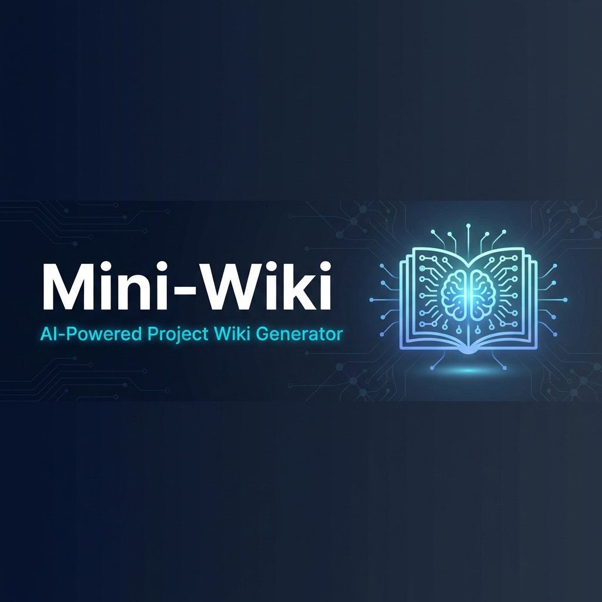

<div align="center">



<br>

[](https://skills.sh)
[](https://github.com/trsoliu/mini-wiki/releases)
[](LICENSE)
[](https://github.com/trsoliu/mini-wiki)

**Transform your codebase into professional-grade, structured documentation with AI** 🚀

[📖 中文文档](README.zh.md) · [🐛 Report Bug](https://github.com/trsoliu/mini-wiki/issues) · [✨ Request Feature](https://github.com/trsoliu/mini-wiki/issues)

</div>

---

## ✨ What is Mini-Wiki?

Mini-Wiki is a [skills.sh](https://skills.sh) compatible skill package that empowers AI Agents to **deeply analyze your codebase** and generate **professional-grade**, structured Wiki documentation with diagrams, cross-links, and detailed explanations — effortlessly.

<table>
<tr>
<td width="50%">

### 💡 Before Mini-Wiki
- Writing docs manually is tedious 📝
- Documentation gets outdated quickly 😩
- No architecture diagrams 📊
- Code references are disconnected 🔗

</td>
<td width="50%">

### 🎉 After Mini-Wiki
- AI generates **professional-grade** docs ✨
- Incremental updates keep docs fresh 🔄
- Beautiful Mermaid diagrams 📈
- Code blocks link to source 🎯
- **Deep code analysis** for detailed content 🔬
- **Cross-linked** documentation network 🔗

</td>
</tr>
</table>

---

## 🎯 Features

<table>
<tr>
<td align="center" width="33%">

<br><b>🔍 Smart Analysis</b>
<br><sub>Auto-detect tech stack and module structure</sub>
</td>
<td align="center" width="33%">

<br><b>🔄 Incremental Update</b>
<br><sub>Only update docs for changed files</sub>
</td>
<td align="center" width="33%">

<br><b>📊 Architecture Diagrams</b>
<br><sub>Auto-generate Mermaid dependency graphs</sub>
</td>
</tr>
<tr>
<td align="center" width="33%">

<br><b>🔗 Code Links</b>
<br><sub>Code blocks link directly to source</sub>
</td>
<td align="center" width="33%">

<br><b>🌐 Multi-language</b>
<br><sub>Support Chinese and English Wiki</sub>
</td>
<td align="center" width="33%">

<br><b>🔌 Plugin System</b>
<br><sub>Extend with custom plugins</sub>
</td>
</tr>
</table>

---

## 🚀 Quick Start

### Installation

Choose your preferred method:

<details open>
<summary><b>📦 Option 1: Using npx (Recommended)</b></summary>

```bash
npx skills add trsoliu/mini-wiki
```

</details>

<details open>
<summary><b>📥 Option 2: Download .skill file</b></summary>

Download `mini-wiki.skill` from [Releases](https://github.com/trsoliu/mini-wiki/releases) and place it in your skills directory.

</details>

<details open>
<summary><b>📂 Option 3: Clone repository</b></summary>

```bash
git clone https://github.com/trsoliu/mini-wiki.git
```

</details>

### Usage

Simply tell your AI Agent:

```
🤖 "generate wiki"
🤖 "create project docs"  
🤖 "update wiki"
```

### Update

Already installed? Update to the latest version:

<details open>
<summary><b>📦 npx (Recommended)</b></summary>

```bash
npx skills update trsoliu/mini-wiki
```

</details>

<details open>
<summary><b>📂 Git clone</b></summary>

```bash
cd mini-wiki && git pull origin main
```

</details>

<details open>
<summary><b>📥 .skill file</b></summary>

Re-download from [Releases](https://github.com/trsoliu/mini-wiki/releases/latest)

</details>

### Plugin Commands

```bash
# Natural Language
📋 "list plugins"
📦 "install plugin <source>"
📦 "install <owner/repo>"  (GitHub shorthand)
🔄 "update plugin <name>"
✅ "enable plugin <name>"
❌ "disable plugin <name>"

# CLI Direct Usage
python scripts/plugin_manager.py list
python scripts/plugin_manager.py install <source>
python scripts/plugin_manager.py update <name>
python scripts/plugin_manager.py enable <name>
```

**Installation Sources:**
- **GitHub**: `owner/repo` (e.g., `vercel-labs/agent-skills`)
- **URL**: `https://example.com/plugin.zip`
- **Local**: `./plugins/my-plugin`

### How Plugins Work

Mini-Wiki uses an **Instruction-based Plugin System**. When you run a task:
1. AI reads `plugins/_registry.yaml`
2. AI reads instructions from `PLUGIN.md` of enabled plugins
3. AI executes plugin logic at specific **Hooks** (e.g., `before_generate`, `on_export`)

### Built-in Plugins

- `code-complexity`: Code health & complexity analysis
- `paper-drafter`: Generate academic paper drafts (LaTeX/IMRaD)
- `repo-analytics`: Multi-dimensional Git analytics & health scoring
- `patent-generator`: Professional patent disclosure generator
- `api-doc-enhancer`: Deep semantic API documentation
- `changelog-generator`: Generate changelog from git
- `diagram-plus`: Enhanced Mermaid diagrams
- `i18n-sync`: Multi-language sync
- `docusaurus-exporter`: Export to Docusaurus
- `gitbook-exporter`: Export to GitBook

---

## 📁 Output Structure

All content is generated to `.mini-wiki/` directory:

```
.mini-wiki/
├── 📄 config.yaml           # Configuration
├── 📂 cache/                 # Incremental cache
├── 📂 wiki/                  # Wiki content
│   ├── index.md
│   ├── architecture.md
│   ├── modules/
│   └── api/
└── 📂 i18n/                  # Multi-language support
    ├── en/
    └── zh/
```

---

## 🏗️ Skill Structure

```
mini-wiki/
├── 📄 SKILL.md              # Main instructions (English)
├── 📂 scripts/              # Python utilities
├── 📂 references/           # Prompts, templates, i18n
├── 📂 assets/               # Config templates
└── 📂 plugins/              # Plugin directory
    ├── _registry.yaml
    └── _example/
```

---

## ❓ FAQ

<details open>
<summary><b>Will updating Mini-Wiki delete my existing docs?</b></summary>

**No.** Updating Mini-Wiki (the skill/plugin itself) only updates the generation rules and templates. It does **NOT** automatically delete or modify any existing documentation.

```bash
npx skills update trsoliu/mini-wiki  # Only updates Mini-Wiki code
```

</details>

<details open>
<summary><b>How do I upgrade low-quality docs generated by older versions?</b></summary>

Use these commands to upgrade existing documentation:

| Command | Behavior |
|---------|----------|
| `generate wiki` | Incremental update - only updates changed files |
| `upgrade wiki` | Detects & upgrades low-quality docs, preserves good ones |
| `refresh all wiki` | Regenerates everything (backs up first) |

Quality is assessed automatically:
- **basic** (< 8 sections, no diagrams) → 🔴 Needs upgrade
- **standard** (8-12 sections, 1 diagram) → 🟡 Optional upgrade
- **professional** (13+ sections, 2+ diagrams) → ✅ Keep as-is

</details>

<details open>
<summary><b>Will my custom content be preserved during upgrade?</b></summary>

**Yes.** Content marked with `<!-- user-content -->` is preserved:

```markdown
## My Custom Section
<!-- user-content -->
This content will NOT be overwritten during upgrade.
<!-- /user-content -->
```

Additionally, all docs are backed up to `cache/backup/` before any upgrade.

</details>

<details open>
<summary><b>How do I check the quality of my existing docs?</b></summary>

Tell your AI Agent:

```
🤖 "check wiki quality"
🤖 "检查 wiki 质量"
```

This generates a quality assessment report showing which docs need upgrading.

</details>

---

## 🙏 Inspired By

<table>
<tr>
<td align="center">
<a href="https://github.com/AsyncFuncAI/deepwiki-open">

<br><b>DeepWiki</b>
</a>
</td>
<td align="center">
<a href="https://github.com/daeisbae/open-repo-wiki">

<br><b>OpenRepoWiki</b>
</a>
</td>
<td align="center">
<a href="https://docs.qoder.com/user-guide/repo-wiki">

<br><b>Qoder Repo Wiki</b>
</a>
</td>
</tr>
</table>

---

## 📄 License

This project is licensed under the [Apache-2.0 License](LICENSE).

---

<div align="center">

## 💬 Contact


**Made with ❤️ by trsoliu**

<a href="https://github.com/trsoliu/mini-wiki">

</a>

### WeChat: `trsoliu`


---

⭐ **Star this repo if you find it helpful!** ⭐

</div>
