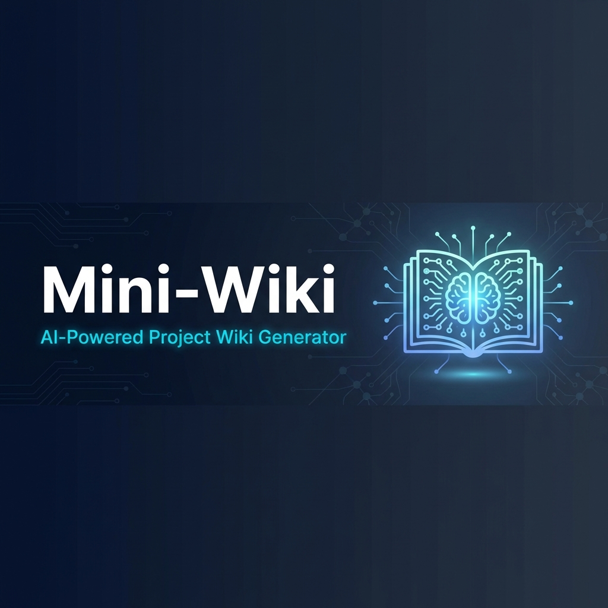

<div align="center">



<br>

[](https://skills.sh)
[](https://github.com/trsoliu/mini-wiki/releases)
[](LICENSE)
[](https://github.com/trsoliu/mini-wiki)

**让 AI 自动将你的代码库转化为专业级的结构化文档** 🚀

[📖 English](README.md) · [🐛 报告问题](https://github.com/trsoliu/mini-wiki/issues) · [✨ 功能建议](https://github.com/trsoliu/mini-wiki/issues)

</div>

---

## ✨ Mini-Wiki 是什么？

Mini-Wiki 是一个 [skills.sh](https://skills.sh) 兼容的技能包，让 AI Agent 能够**深度分析你的代码库**，生成**专业级**的结构化 Wiki 文档，包含图表、交叉链接和详细说明 —— 轻松省心。

<table>
<tr>
<td width="50%">

### 💡 使用 Mini-Wiki 之前
- 手写文档很无聊 📝
- 文档很快就过时 😩
- 没有架构图 📊
- 代码引用断开 🔗

</td>
<td width="50%">

### 🎉 使用 Mini-Wiki 之后
- AI 生成**专业级**文档 ✨
- 增量更新保持新鲜 🔄
- 漂亮的 Mermaid 图表 📈
- 代码块链接到源码 🎯
- **深度代码分析**生成详细内容 🔬
- **交叉链接**的文档网络 🔗

</td>
</tr>
</table>

---

## 🎯 特性

<table>
<tr>
<td align="center" width="33%">

<br><b>🔍 智能项目分析</b>
<br><sub>支持 Monorepo/Rust/Go/Python/Node 深度分析</sub>
</td>
<td align="center" width="33%">

<br><b>🔄 增量更新</b>
<br><sub>仅更新变更文件的文档</sub>
</td>
<td align="center" width="33%">

<br><b>📊 架构图</b>
<br><sub>自动生成 Mermaid 依赖图</sub>
</td>
</tr>
<tr>
<td align="center" width="33%">

<br><b>🔗 代码链接</b>
<br><sub>文档代码块直接链接源码</sub>
</td>
<td align="center" width="33%">

<br><b>🌐 多语言</b>
<br><sub>支持中英文 Wiki 生成</sub>
</td>
<td align="center" width="33%">

<br><b>🔌 插件系统</b>
<br><sub>支持自定义插件扩展</sub>
</td>
</tr>
</table>

---

## 🚀 快速开始

### 安装

选择你喜欢的方式：

<details open>
<summary><b>📦 方式 1：使用 npx（推荐）</b></summary>

```bash
npx skills add trsoliu/mini-wiki
```

</details>

<details open>
<summary><b>📥 方式 2：下载 .skill 文件</b></summary>

从 [Releases](https://github.com/trsoliu/mini-wiki/releases) 下载 `mini-wiki.skill` 文件。

</details>

<details open>
<summary><b>📂 方式 3：克隆仓库</b></summary>

```bash
git clone https://github.com/trsoliu/mini-wiki.git
```

</details>

### 使用

安装后，对 AI Agent 说：

```
🤖 "生成 wiki"
🤖 "创建项目文档"  
🤖 "更新 wiki"
```

### 更新

已安装？更新到最新版本：

<details open>
<summary><b>📦 npx（推荐）</b></summary>

```bash
npx skills update trsoliu/mini-wiki
```

</details>

<details open>
<summary><b>📂 Git clone</b></summary>

```bash
cd mini-wiki && git pull origin main
```

</details>

<details open>
<summary><b>📥 .skill 文件</b></summary>

从 [Releases](https://github.com/trsoliu/mini-wiki/releases/latest) 重新下载

</details>

### 插件命令

```bash
# 自然语言指令
📋 "列出插件"
📦 "安装插件 <source>"
📦 "安装 <owner/repo>"  (GitHub 简写)
🔄 "更新插件 <name>"
✅ "启用插件 <name>"
❌ "禁用插件 <name>"

# 命令行高级用法
python scripts/plugin_manager.py list
python scripts/plugin_manager.py install <source>
python scripts/plugin_manager.py update <name>
python scripts/plugin_manager.py enable <name>
```

**安装来源:**
- **GitHub**: `owner/repo` (例如 `vercel-labs/agent-skills`)
- **URL**: `https://example.com/plugin.zip`
- **本地**: `./plugins/my-plugin`

### 插件工作原理

Mini-Wiki 采用 **指令型插件系统**。当你运行任务时：
1. AI 读取 `plugins/_registry.yaml`
2. AI 读取启用插件的 `PLUGIN.md` 指令
3. AI 在特定的 **Hooks**（如 `before_generate`, `on_export`）**应用插件指令（仅文本）**

**执行模型（安全说明）**：
- 插件为**纯指令**，Agent **不会执行**插件代码或脚本。
- `PLUGIN.md` 中的 CLI 命令仅供人工操作，Agent 不应执行。

### 内置插件

- `code-complexity`: 代码健康度与复杂度分析
- `paper-drafter`: 专家级学术论文生成 (LaTeX/IMRaD)
- `repo-analytics`: 多维度 Git 分析与健康度评分
- `patent-generator`: 专业级专利技术交底书生成
- `api-doc-enhancer`: 深度语义 API 文档生成
- `changelog-generator`: 从 Git 生成变更日志
- `diagram-plus`: 增强型 Mermaid 图表
- `i18n-sync`: 多语言同步工具
- `docusaurus-exporter`: 导出为 Docusaurus 格式
- `gitbook-exporter`: 导出为 GitBook 格式

---

## 📁 输出结构

所有内容生成到 `.mini-wiki/` 目录：

```
.mini-wiki/
├── 📄 config.yaml           # 配置文件
├── 📂 cache/                 # 增量缓存
├── 📂 wiki/                  # Wiki 内容
│   ├── index.md
│   ├── architecture.md
│   ├── modules/
│   └── api/
└── 📂 i18n/                  # 多语言支持
    ├── en/
    └── zh/
```

> [!TIP]
> 建议将 `.mini-wiki/` 添加到您的 `.gitignore` 文件中，以避免将生成的内容提交到代码仓库。

---

## 🏗️ 技能结构

```
mini-wiki/
├── 📄 SKILL.md              # 主指令（英文）
├── 📂 scripts/              # Python 工具脚本
├── 📂 references/           # 提示词、模板、国际化
├── 📂 assets/               # 配置模板
└── 📂 plugins/              # 插件目录
    ├── _registry.yaml
    └── _example/
```

---

## ❓ 常见问题

<details open>
<summary><b>更新 Mini-Wiki 会删除已有的文档吗？</b></summary>

**不会。** 更新 Mini-Wiki（技能/插件本身）只会更新生成规则和模板，**不会**自动删除或修改任何已生成的文档。

```bash
npx skills update trsoliu/mini-wiki  # 只更新 Mini-Wiki 代码
```

</details>

<details open>
<summary><b>如何升级旧版本生成的低质量文档？</b></summary>

使用以下命令升级现有文档：

| 命令 | 行为 |
|------|------|
| `生成 wiki` | 增量更新 - 只更新变更的文件 |
| `升级 wiki` | 检测并升级低质量文档，保留高质量的 |
| `刷新全部 wiki` | 重新生成所有文档（会先备份） |

质量自动评估：
- **basic**（< 8 章节，无图表）→ 🔴 需要升级
- **standard**（8-12 章节，1 个图表）→ 🟡 可选升级
- **professional**（13+ 章节，2+ 图表）→ ✅ 保持不变

</details>

<details open>
<summary><b>升级时会保留我自定义的内容吗？</b></summary>

**会的。** 使用 `<!-- user-content -->` 标记的内容会被保留：

```markdown
## 我的自定义章节
<!-- user-content -->
这部分内容在升级时不会被覆盖。
<!-- /user-content -->
```

另外，所有文档在升级前都会自动备份到 `cache/backup/`。

</details>

<details open>
<summary><b>如何检查现有文档的质量？</b></summary>

告诉你的 AI Agent：

```
🤖 "检查 wiki 质量"
🤖 "check wiki quality"
```

这会生成一份质量评估报告，显示哪些文档需要升级。

</details>

---

## 🙏 灵感来源

<table>
<tr>
<td align="center">
<a href="https://github.com/AsyncFuncAI/deepwiki-open">

<br><b>DeepWiki</b>
</a>
</td>
<td align="center">
<a href="https://github.com/daeisbae/open-repo-wiki">

<br><b>OpenRepoWiki</b>
</a>
</td>
<td align="center">
<a href="https://docs.qoder.com/user-guide/repo-wiki">

<br><b>Qoder Repo Wiki</b>
</a>
</td>
</tr>
</table>

---

## 📄 许可证

本项目采用 [Apache-2.0 许可证](LICENSE)。

---

<div align="center">

## 💬 联系方式


**用 ❤️ 制作 by trsoliu**

<a href="https://github.com/trsoliu/mini-wiki">

</a>

### 微信: `trsoliu`


---

⭐ **如果觉得有帮助，请给个 Star！** ⭐

</div>
