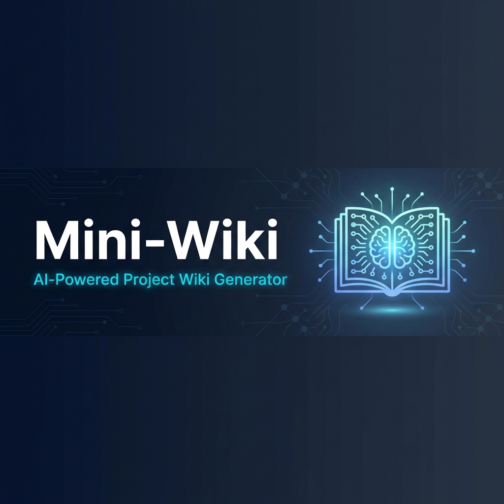

<div align="center">



[](https://github.com/trsoliu/mini-wiki/releases)
[](pyproject.toml)
[](LICENSE)
[](https://skills.sh)

**面向 AI Agent、Markdown 与 Obsidian 的源码可追溯项目知识网络**

[English](README.md) · [Skill 说明](SKILL.md) · [更新日志](CHANGELOG.md)

</div>

## Mini-Wiki 是什么

Mini-Wiki 3.3 将代码仓库构建成确定性、可版本化、可搜索的 Markdown 知识网络。它充分学习 Obsidian
最有价值的知识管理能力——Properties、链接/反向链接、Bases、Canvas 和可选应用集成——同时保证所有
核心工作流不依赖 Obsidian。

职责被明确拆分：

- CLI 负责扫描、稳定 ID、图谱、托管 Markdown、导航、校验、搜索、Bases、Canvas、Manifest、事务与迁移；
- AI Agent 只在受保护内容区内编写有源码证据的专业解释；
- Git 保存正式知识历史；
- Obsidian 是可选的阅读、查询和空间探索界面。

## 3.3.0 升级内容

- 正式 Wiki 迁移为仓库根级 `wiki/` 目录。
- 稳定知识图谱连接项目、领域、模块、源文件、符号与文档。
- 托管 Markdown 在重建时保留 Agent 内容与用户自定义 Properties。
- 事务构建、Manifest、dry-run、严格校验和可恢复归档保证更新稳定。
- 独立的中文感知搜索支持 FTS5 加速与一致的后备实现。
- 四个原生 Obsidian Bases 覆盖模块、源码、质量和孤立页面治理。
- 三个确定性 JSON Canvas 1.0 视图展示架构、领域和源码追溯。
- Obsidian 检测/打开与核心命令隔离。
- 第三方插件以默认禁用、instruction-only 文本方式安全安装。

## 正式知识与本地状态边界

```text
wiki/                         # 正式、可移植知识，建议提交 Git
├── index.md
├── getting-started.md
├── architecture.md
├── knowledge-map.md
├── domains/
├── reference/
├── views/
│   ├── modules.base
│   ├── sources.base
│   ├── quality.base
│   └── orphans.base
└── canvas/
    ├── architecture.canvas
    ├── domains.canvas
    └── traceability.canvas

.mini-wiki/                   # 配置与可重建/本地状态
├── config.yaml
├── manifest.json
├── meta.json
├── cache/
│   ├── analysis.json
│   ├── graph.json
│   ├── build-plan.json
│   └── search.sqlite3
├── staging/
└── archive/                  # 退出管理的页面，可恢复
```

Mini-Wiki 无需创建或修改 `.obsidian/`。正式文档只使用仓库相对链接，在浏览器、编辑器、Git 平台和
任意 Markdown 工具中都能阅读。

## 安装

作为 Agent Skill 安装：

```bash
npx skills add trsoliu/mini-wiki
```

安装本地 CLI：

```bash
git clone https://github.com/trsoliu/mini-wiki.git
cd mini-wiki
python -m venv .venv
.venv/bin/pip install -e .
.venv/bin/mini-wiki --version
```

开发依赖可通过 `pip install -e '.[dev]'` 安装。

## 构建 Wiki

```bash
mini-wiki init /path/to/project
mini-wiki doctor --json /path/to/project
mini-wiki build --dry-run --json /path/to/project
mini-wiki build --json /path/to/project
mini-wiki check --strict --json /path/to/project
mini-wiki search "架构决策" --json /path/to/project
```

首次构建后，Agent 读取构建计划与图谱，只在 `mini-wiki:content` 区域补充源码可证实的专业内容，
然后重新构建和严格校验。仓库未变化时，第二次构建不应出现无法解释的差异。

## 托管 Markdown 契约

```markdown
---
id: mw:document:domains/core/core
title: Core
type: module
domain: core
sources:
  - src/core/app.py
freshness: current
quality: basic
mini_wiki_version: 3.3.0
---

<!-- mini-wiki:generated:start -->
CLI 管理的导航、证据和关系。
<!-- mini-wiki:generated:end -->

<!-- mini-wiki:content:start -->
Agent 管理的专业解释，重建时逐字保留。
<!-- mini-wiki:content:end -->
```

未知 Properties 属于用户并会被保留。无所有权标记的文档不会被接管或覆盖。消失的托管页面会进入
`.mini-wiki/archive/`，不会被静默删除。

## 不依赖 Obsidian 的搜索

```bash
mini-wiki search "插件安装" --json /path/to/project
mini-wiki search "storage" --type module --tag domain/storage --limit 10 /path/to/project
```

本地索引组合 Markdown、Properties、别名、标签、图谱元数据和有界源码文本。确定性的 CJK 单字/双字
归一化支持中文与中英混合查询。SQLite FTS5 只是加速器；不可用时，后备实现保持相同的过滤与排序规则。

## Properties、Bases 与 Canvas

Properties 是页面与派生视图唯一的元数据模型。

| 产物 | 用途 |
| --- | --- |
| `views/modules.base` | 模块状态、新鲜度、质量与反向链接 |
| `views/sources.base` | 源码覆盖与漂移 |
| `views/quality.base` | 评审和内容补强队列 |
| `views/orphans.base` | 未接入知识网络的页面 |
| `canvas/architecture.canvas` | 架构层次和依赖 |
| `canvas/domains.canvas` | 领域与模块地图 |
| `canvas/traceability.canvas` | 文档到源码和符号的追溯关系 |

Bases 是基于 Properties 的原生声明式视图。Canvas 是知识图谱的确定性 JSON Canvas 1.0 投影；应修改
事实源并重建，而不是在生成视图中保存唯一知识。

## 校验与恢复

```bash
mini-wiki check --strict --json /path/to/project
mini-wiki migrate --json /path/to/project
mini-wiki migrate --apply --json /path/to/project
mini-wiki migrate --apply --adopt --json /path/to/project
```

严格模式检查 ID、链接、源码边界与漂移、所有权标记、孤立页面、Base schema，以及 Canvas 节点和边。
迁移默认只预览；正式迁移会拒绝非空目标、备份旧资料、验证复制结果，并且只在成功后切换配置。
`--adopt` 将旧页面正文完整保留在 Agent 内容区。

## 可选 Obsidian 集成

```bash
mini-wiki obsidian status --json /path/to/project
mini-wiki obsidian status --probe --json /path/to/project
mini-wiki obsidian open /path/to/project
```

普通 `status` 无副作用。`--probe` 会显式调用 Obsidian CLI，可能启动应用。`open` 是唯一请求 Obsidian
打开 Wiki 的命令，通过编码后的 Obsidian URI 工作。构建、搜索、校验、迁移、Bases 和 Canvas 生成均不
依赖 Obsidian。

## instruction-only 插件

```bash
mini-wiki plugins list /path/to/project
mini-wiki plugins install owner/repository /path/to/project
mini-wiki plugins enable plugin-name /path/to/project
mini-wiki plugins disable plugin-name /path/to/project
mini-wiki plugins update plugin-name /path/to/project
mini-wiki plugins uninstall plugin-name /path/to/project
```

插件说明是不可信文本。Agent 可以阅读已启用的 `PLUGIN.md` 或 `SKILL.md` 并应用相关指导，但绝不导入
或执行插件脚本、Hook、包管理器和命令。网络源必须使用 HTTPS；安装会拒绝路径穿越、符号链接、非法
根目录、超限归档和静默覆盖。第三方插件默认禁用，并记录目录树哈希。

## 配置

`mini-wiki init` 创建 schema v3 配置，可分别控制搜索、Bases、Canvas 与可选 Obsidian 集成。扫描会
遵守 Git ignore、配置排除项、符号链接边界、文件大小上限、状态目录和 Wiki 目录。

完整 Agent 协议见 [SKILL.md](SKILL.md)，中文执行细则见 [中文工作流](references/SKILL.zh.md)，证据优先
提示词见 [prompts](references/prompts.md)，托管页面模板见 [templates](references/templates.md)。

## 开发验证

```bash
.venv/bin/python -m pytest -q
.venv/bin/ruff check scripts tests
.venv/bin/ruff format --check scripts tests
.venv/bin/mypy scripts
```

## 许可证

[MIT](LICENSE)
