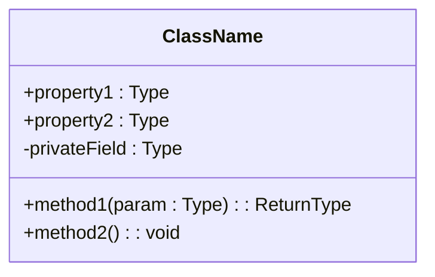
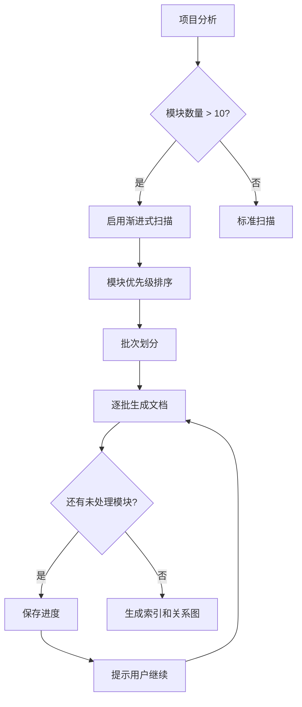
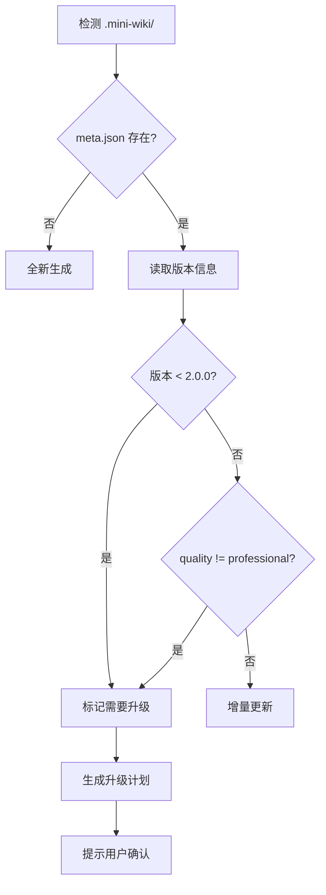

# Wiki Generator

Generate **professional-grade** structured project Wiki to `.mini-wiki/` directory.

> **核心原则**：生成的文档必须 **详细、结构化、有图表、相互关联**，达到企业级技术文档标准。

## 📋 Documentation Quality Standards

**CRITICAL**: All generated documentation MUST meet these standards:

### Content Depth
- Every topic must have **complete context** - no bare lists or skeleton content
- Descriptions must be **detailed and specific** - explain WHY and HOW
- Must include **working code examples** with expected output
- Must document **edge cases, warnings, common pitfalls**

### Structure Requirements
- Use **hierarchical headings** (H2/H3/H4) for clear information architecture
- Important concepts in **tables** for quick reference
- Processes visualized with **Mermaid diagrams**
- **Cross-links** between related documents

### Diagram Requirements (minimum 2-3 per document)
| Content Type | Diagram Type |
|--------------|--------------|
| Architecture | `flowchart TB` with subgraphs |
| Data/Call flow | `sequenceDiagram` |
| State changes | `stateDiagram-v2` |
| **Class/Interface** | `classDiagram` with properties + methods |
| Dependencies | `flowchart LR` |

### 🔴 MANDATORY: Source Code Traceability

**Every section MUST include source references** at the end:

```markdown
**Section sources**
- [filename.ts](file://path/to/file.ts#L1-L50)
- [another.ts](file://path/to/another.ts#L20-L80)

**Diagram sources**
- [architecture.ts](file://src/architecture.ts#L1-L100)
```

### 🔴 MANDATORY: Dynamic Quality Standards

**质量标准基于模块复杂度动态计算，而非固定数字**

#### 复杂度评估因子

```yaml
complexity_factors:
  # 源码指标
  source_lines: 0       # 模块源码行数
  file_count: 0         # 文件数量
  export_count: 0       # 导出的接口数量
  dependency_count: 0   # 依赖的模块数
  dependent_count: 0    # 被依赖次数
  
  # 项目上下文
  project_type: "fullstack"  # frontend / backend / fullstack / library / cli
  language: "typescript"     # typescript / python / go / java / rust
  module_role: "core"        # core / util / config / test / example
```

#### 动态质量公式

| 指标 | 计算公式 | 说明 |
|------|----------|------|
| **文档行数** | `max(100, source_lines × 0.3 + export_count × 20)` | 源码越多，文档越长 |
| **代码示例** | `max(2, export_count × 0.5)` | 每个导出接口至少 0.5 个示例 |
| **图表数量** | `max(1, ceil(file_count / 5))` | 每 5 个文件 1 个图表 |
| **章节数** | `6 + module_role_weight` | 核心模块章节更多 |

#### 模块角色权重

| 角色 | 权重 | 期望深度 |
|------|------|----------|
| **core** (核心) | +4 | 深度分析、完整示例、性能优化 |
| **util** (工具) | +2 | 接口说明、使用示例 |
| **config** (配置) | +1 | 配置项说明、默认值 |
| **test** (测试) | +0 | 测试策略、覆盖率 |
| **example** (示例) | +0 | 运行说明 |

#### 项目类型适配

| 项目类型 | 重点内容 |
|----------|----------|
| **frontend** | 组件 Props、状态管理、UI 交互示例 |
| **backend** | API 接口、数据模型、中间件示例 |
| **fullstack** | 前后端交互、数据流、部署配置 |
| **library** | API 文档、类型定义、兼容性说明 |
| **cli** | 命令参数、配置文件、使用示例 |

#### 语言适配

| 语言 | 示例风格 |
|------|----------|
| **TypeScript** | 类型注解、泛型示例、接口定义 |
| **Python** | docstring、类型提示、装饰器示例 |
| **Go** | 错误处理、并发示例、接口实现 |
| **Rust** | 所有权、生命周期、错误处理 |

### Module Document Sections

根据模块角色动态包含以下章节：

| 章节 | core | util | config | 内容 |
|------|:----:|:----:|:------:|------|
| **概述** | ✅ | ✅ | ✅ | 介绍、价值、架构位置图 |
| **核心功能** | ✅ | ✅ | - | 功能表格 + classDiagram |
| **目录结构** | ✅ | ✅ | - | 文件树 + 职责说明 |
| **API/接口** | ✅ | ✅ | ✅ | 导出接口、类型定义 |
| **代码示例** | ✅ | ✅ | ✅ | 基础/高级/错误处理 |
| **最佳实践** | ✅ | - | - | 推荐/避免做法 |
| **性能优化** | ✅ | - | - | 性能技巧、基准数据 |
| **错误处理** | ✅ | ✅ | - | 常见错误、调试技巧 |
| **依赖关系** | ✅ | ✅ | ✅ | 依赖图 |
| **相关文档** | ✅ | ✅ | ✅ | 交叉链接 |

### 🔴 Code Examples (Target: AI & Architecture Review)

**文档主要受众是 AI 和架构评审**，代码示例必须：

1. **完整可运行**：包含 import、初始化、调用、结果处理
2. **覆盖导出接口**：每个主要导出 API 至少 1 个示例
3. **包含注释说明**：解释关键步骤和设计意图
4. **适配项目语言**：遵循语言最佳实践

```typescript
// ✅ 好的示例：完整、可运行、有注释
import { AgentClient } from '@editverse/agent-core';

// 1. 创建客户端（展示必需配置）
const agent = await AgentClient.create({
  provider: 'openai',
  model: 'gpt-4',
});

// 2. 基础对话
const response = await agent.chat({
  messages: [{ role: 'user', content: '你好' }],
});
console.log(response.content);

// 3. 错误处理
try {
  await agent.chat({ messages: [] });
} catch (error) {
  if (error.code === 'INVALID_MESSAGES') {
    console.error('消息列表不能为空');
  }
}
```

**示例类型根据导出 API 数量动态调整**：
| 导出数量 | 示例要求 |
|----------|----------|
| 1-3 | 每个 API 1 个基础示例 + 1 个错误处理 |
| 4-10 | 核心 API 各 1 个示例 + 1 个集成示例 |
| 10+ | 分类示例（按功能分组） |

### 🔴 MANDATORY: classDiagram for Core Classes

For every core class/interface, generate detailed classDiagram:



### Document Relationships
- Every document must have **"Related Documents"** section
- Module docs link to: architecture position, API reference, dependencies
- API docs link to: parent module, usage examples, type definitions

---

## Output Structure

### 🔴 MANDATORY: Business Domain Hierarchy (Not Flat!)

**按业务领域分层组织，而不是扁平的 modules/ 目录**

```
.mini-wiki/
├── config.yaml
├── meta.json
├── cache/
├── wiki/
│   ├── index.md                    # 项目首页
│   ├── architecture.md             # 系统架构
│   ├── getting-started.md          # 快速开始
│   ├── doc-map.md                  # 文档关系图
│   │
│   ├── AI系统/                      # 业务领域 1
│   │   ├── _index.md               # 领域概述
│   │   ├── Agent核心/              # 子领域
│   │   │   ├── _index.md
│   │   │   ├── 客户端.md           # 400+ 行
│   │   │   └── 工具系统.md         # 400+ 行
│   │   ├── MCP协议/
│   │   │   ├── _index.md
│   │   │   └── 配置管理.md
│   │   └── 对话流程/
│   │       ├── 状态管理.md
│   │       └── 响应处理.md
│   │
│   ├── 存储系统/                    # 业务领域 2
│   │   ├── _index.md
│   │   ├── 状态管理/
│   │   │   └── Zustand.md
│   │   └── 持久化/
│   │       └── 存储适配.md
│   │
│   ├── 编辑器/                      # 业务领域 3
│   │   ├── _index.md
│   │   ├── 核心/
│   │   └── 扩展/
│   │
│   ├── 跨平台/                      # 业务领域 4
│   │   ├── _index.md
│   │   ├── Electron/
│   │   └── Web/
│   │
│   └── api/                        # API 参考
└── i18n/
```

### Domain Auto-Detection

分析代码后，自动识别业务领域：

```yaml
# 自动识别的业务领域映射
domain_mapping:
  AI系统:
    keywords: [agent, ai, llm, chat, mcp, tool]
    packages: [agent-core, agent, mcp-core, agent-bridge]
  存储系统:
    keywords: [store, storage, persist, state]
    packages: [store, storage, electron-secure-storage]
  编辑器:
    keywords: [editor, tiptap, markdown, document]
    packages: [editor-core, markdown, docx2tiptap-core]
  跨平台:
    keywords: [electron, desktop, web, app]
    packages: [apps/*, browser-core, electron-*]
  组件库:
    keywords: [component, ui, shadcn]
    packages: [shadcn-ui, chat-ui, media-viewer]
```

### 🔴 每个业务领域必须包含

| 文件 | 说明 |
|------|------|
| `_index.md` | 领域概述、架构图、子模块列表 |
| 子领域目录 | 相关模块按功能分组 |
| 每个文档 | **400+ 行、5+ 代码示例** |

## 🔌 Plugin Execution Protocol

**CRITICAL**: As an AI executing this skill, you **MUST** follow this protocol to activate installed plugins.

1.  **Load Registry**: Read `plugins/_registry.yaml` to see enabled plugins.
2.  **Read Manifests**: For each enabled plugin, read its `PLUGIN.md` to understand its **Hooks** and **Instructions**.
3.  **Execute Hooks**:
    *   **Pre-Analysis**: If plugin has `on_init`, follow its instructions before starting.
    *   **Post-Analysis**: If plugin has `after_analyze`, apply its logic after analyzing structure.
    *   **Pre-Generation**: If plugin has `before_generate`, modify your generation plan/prompts.
    *   **Post-Generation**: If plugin has `after_generate` or `on_export`, execute those tasks after wiki creation.

> **Example**: If `api-doc-enhancer` is enabled, you MUST read its `PLUGIN.md` and follow its specific rules for generating API docs.

## Workflow

### 1. Initialization Check

Check if `.mini-wiki/` exists:
- **Not exists**: Run `scripts/init_wiki.py` to create directory structure
- **Exists**: Read `config.yaml` and cache, perform incremental update

### 2. Plugin Discovery

Check `plugins/` directory for installed plugins:
1. Read `plugins/_registry.yaml` for enabled plugins
2. For each enabled plugin, read `PLUGIN.md` manifest
3. Register hooks: `on_init`, `after_analyze`, `before_generate`, `after_generate`

### 3. Project Analysis (Deep)

Run `scripts/analyze_project.py` or analyze manually:

1. **Identify tech stack**: Check package.json, requirements.txt, etc.
2. **Find entry points**: src/index.ts, main.py, etc.
3. **Identify modules**: Scan src/ directory structure
4. **Find existing docs**: README.md, CHANGELOG.md, etc.
5. **Execute `after_analyze` hooks** from plugins

Save structure to `cache/structure.json`.

### 4. Deep Code Analysis (NEW - CRITICAL)

**IMPORTANT**: For each module, you MUST read and analyze the actual source code:

1. **Read source files**: Use read_file tool to read key source files
2. **Understand code semantics**: Analyze what the code does, not just its structure
3. **Extract detailed information**:
   - Function purposes, parameters, return values, side effects
   - Class hierarchies and relationships
   - Data flow and state management
   - Error handling patterns
   - Design patterns used
4. **Identify relationships**: Module dependencies, call graphs, data flow

> 📖 See `references/prompts.md` → "代码深度分析" for the analysis prompt template

### 5. Change Detection

Run `scripts/detect_changes.py` to compare file checksums:
- New files → Generate docs
- Modified files → Update docs
- Deleted files → Mark obsolete

### 6. Content Generation (Professional Grade)

Execute `before_generate` hooks from plugins, then generate content following **strict quality standards**:

#### 6.1 Homepage (`index.md`)
Must include:
- Project badges and one-liner description
- **2-3 paragraphs** detailed introduction (not just bullet points)
- Architecture preview diagram (Mermaid flowchart)
- Documentation navigation table with audience
- Core features table with links to modules
- Quick start code example with expected output
- Project statistics table
- Module overview table with links

#### 6.2 Architecture Doc (`architecture.md`)
Must include:
- Executive summary (positioning, tech overview, architecture style)
- **System architecture diagram** (Mermaid flowchart TB with subgraphs)
- Tech stack table with version and selection rationale
- **Module dependency diagram** (Mermaid flowchart)
- Detailed module descriptions with responsibility and interfaces
- **Data flow diagram** (Mermaid sequenceDiagram)
- **State management diagram** (if applicable)
- Directory structure with explanations
- Design patterns and principles
- Extension guide

#### 6.3 Module Docs (`modules/<name>.md`)
Each module doc must include (16 sections minimum):
1. Module overview (2-3 paragraphs, not 2-3 sentences)
2. Core value proposition
3. **Architecture position diagram** (highlight current module)
4. Feature table with related APIs
5. File structure with responsibility descriptions
6. **Core workflow diagram** (Mermaid flowchart)
7. **State diagram** (if applicable)
8. Public API overview table
9. Detailed API documentation (signature, params, returns, examples)
10. Type definitions with field tables
11. Quick start code
12. **3+ usage examples** with scenarios
13. Best practices (do's and don'ts)
14. Design decisions and trade-offs
15. **Dependency diagram**
16. Related documents links

#### 6.4 API Docs (`api/<name>.md`)
Each API doc must include:
- Module overview with import examples
- API overview table
- Type definitions with property tables
- For each function:
  - One-liner + detailed description (3+ sentences)
  - Function signature
  - Parameter table with constraints and defaults
  - Return value with possible cases
  - Exception table
  - **3 code examples** (basic, advanced, error handling)
  - Warnings and tips
  - Related APIs
- For classes: class diagram, constructor, properties, methods
- Usage patterns (2-3 complete scenarios)
- FAQ section
- Related documents

#### 6.5 Getting Started (`getting-started.md`)
Must include:
- Prerequisites table with version requirements
- Multiple installation methods
- Configuration file explanation
- Step-by-step first example
- Next steps table
- Common issues FAQ

#### 6.6 Doc Map (`doc-map.md`)
Must include:
- **Document relationship diagram** (Mermaid flowchart)
- Reading path recommendations by role
- Complete document index
- Module dependency matrix

Execute `after_generate` hooks from plugins.

### 7. Source Code Links

Add source links to code blocks:
```markdown
### `functionName` [📄](file:///path/to/file.ts#L42)
```

### 8. Save

- Write wiki files to `.mini-wiki/wiki/`
- Update `cache/checksums.json`
- Update `meta.json` timestamp

---

## 🚀 Large Project Progressive Scanning

**问题**：大型项目时，AI 可能只生成少量文档而没有全面覆盖所有模块。

### 触发条件

当项目满足以下任一条件时，必须使用渐进式扫描策略：
- 模块数量 > 10
- 源文件数量 > 50
- 代码行数 > 10,000

### 渐进式扫描策略



### 执行步骤

#### Step 1: 模块优先级排序
按以下维度计算优先级分数：

| 维度 | 权重 | 说明 |
|------|------|------|
| 入口点 | 5 | main.py, index.ts 等 |
| 被依赖次数 | 4 | 被其他模块 import 的次数 |
| 代码行数 | 2 | 较大的模块优先 |
| 有现有文档 | 3 | README 或 docs 存在 |
| 最近修改 | 1 | 最近修改的优先 |

#### Step 2: 批次划分

**🔴 关键：每批 1-2 个模块，深度基于模块复杂度动态调整**

```yaml
batch_config:
  batch_size: 1              # 每批处理 1-2 个模块
  quality_mode: dynamic      # dynamic / fixed
  pause_between_batches: true
  auto_continue: false
```

**批次分配示例**（按业务领域 + 复杂度）:
| 批次 | 内容 | 复杂度 | 期望行数 |
|------|------|--------|----------|
| 1 | `index.md` | - | 150+ |
| 2 | `architecture.md` | - | 200+ |
| 3 | `AI系统/Agent核心/客户端.md` | 2000行源码, 15导出 | 600+ |
| 4 | `存储系统/Zustand.md` | 500行源码, 8导出 | 250+ |
| 5 | `配置/constants.md` | 100行源码, 3导出 | 100+ |
| ... | **深度与复杂度成正比** | 动态计算 |

#### Step 3: 进度跟踪
在 `cache/progress.json` 中记录：
```json
{
  "version": "2.0.0",
  "total_modules": 25,
  "completed_modules": ["core", "utils", "api"],
  "pending_modules": ["auth", "db", ...],
  "current_batch": 2,
  "last_updated": "2026-01-28T21:15:00Z",
  "quality_version": "professional-v2"
}
```

#### Step 4: 断点续传
当用户说 "继续生成 wiki" 或 "continue wiki generation" 时：
1. 读取 `cache/progress.json`
2. 跳过已完成的模块
3. 从下一批次继续

### 🔴 每批次质量检查

**生成每批后，必须验证质量**：

```bash
# 检查本批生成的文档
python scripts/check_quality.py .mini-wiki --verbose
```

**质量门槛（动态计算）**：

质量检查基于模块复杂度动态评估，而非固定数字：

```bash
# 运行动态质量检查
python scripts/check_quality.py .mini-wiki --analyze-complexity
```

| 指标 | 计算方式 | 未达标处理 |
|------|----------|-----------|
| 行数 | `max(100, source_lines × 0.3)` | 重新生成 |
| 章节数 | `6 + role_weight` | 补充章节 |
| 图表数 | `max(1, files / 5)` | 添加图表 |
| 代码示例 | `max(2, exports × 0.5)` | 补充示例 |
| 源码追溯 | 每章节必需 | 添加引用 |

**质量评级**：
| 等级 | 说明 |
|------|------|
| 🟢 **Excellent** | 超过期望值 20%+ |
| 🟡 **Good** | 达到期望值 |
| 🟠 **Acceptable** | 达到期望值 80%+ |
| 🔴 **Needs Work** | 低于期望值 80% |

### 用户交互提示

每批次完成后，向用户报告：
```
✅ 第 2 批完成 (6/25 模块)

已生成:
- modules/store.md (245 行, Professional ✅)
- modules/editor-core.md (312 行, Professional ✅)

质量检查: 全部通过 ✅

待处理: 19 个模块
预计还需: 10 批次

👉 输入 "继续" 生成下一批
👉 输入 "检查质量" 运行质量检查
👉 输入 "重新生成 <模块名>" 重新生成特定模块
```

### 配置选项

```yaml
# .mini-wiki/config.yaml
progressive:
  enabled: auto               # auto / always / never
  batch_size: 1               # 每批模块数（1-2 确保深度）
  min_lines_per_doc: 400      # 每个文档最少行数
  min_code_examples: 5        # 每个文档最少代码示例数
  quality_check: true         # 每批后自动检查质量
  auto_continue: false        # 自动继续无需确认
  
# 业务领域分层配置
domain_hierarchy:
  enabled: true               # 启用业务领域分层
  auto_detect: true           # 自动识别业务领域
  language: zh                # 目录名语言 (zh/en)
  priority_weights:           # 自定义优先级权重
    entry_point: 5
    dependency_count: 4
    code_lines: 2
    has_docs: 3
    recent_modified: 1
  skip_modules:               # 跳过的模块
    - __tests__
    - examples
```

---

## 🔄 Documentation Upgrade & Refresh

**问题**：升级 mini-wiki 后，之前生成的低质量文档需要刷新升级。

### 版本检测机制

在 `meta.json` 中记录文档生成版本，并在每个文档页脚显示：

**页脚格式**: `*由 [Mini-Wiki v{{ MINI_WIKI_VERSION }}](https://github.com/trsoliu/mini-wiki) 自动生成 | {{ GENERATED_AT }}*`

```json
{
  "generator_version": "3.0.6",  // 用于 {{ MINI_WIKI_VERSION }}
  "quality_standard": "professional-v2",
  "generated_at": "2026-01-28T21:15:00Z",
  "modules": {
    "core": {
      "version": "1.0.0",
      "quality": "basic",
      "sections": 6,
      "has_diagrams": false,
      "last_updated": "2026-01-20T10:00:00Z"
    }
  }
}
```

### 质量评估标准

| 质量等级 | 章节数 | 图表数 | 示例数 | 交叉链接 |
|---------|--------|--------|--------|----------|
| `basic` | < 8 | 0 | 0-1 | 无 |
| `standard` | 8-12 | 1 | 1-2 | 部分 |
| `professional` | 13-16 | 2+ | 3+ | 完整 |

### 升级触发条件



### 升级策略

#### 策略 1: 全量刷新 (`refresh_all`)
适用于：版本差异大、文档质量差
```
用户命令: "刷新全部 wiki" / "refresh all wiki"
```

#### 策略 2: 渐进式升级 (`upgrade_progressive`)
适用于：模块多、希望保留部分内容
```
用户命令: "升级 wiki" / "upgrade wiki"
```

#### 策略 3: 选择性升级 (`upgrade_selective`)
适用于：只想升级特定模块
```
用户命令: "升级 core 模块文档" / "upgrade core module docs"
```

### 升级执行流程

#### Step 1: 扫描现有文档
```python
# 伪代码
for doc in existing_docs:
    score = evaluate_quality(doc)
    if score.sections < 10 or not score.has_diagrams:
        mark_for_upgrade(doc, priority=HIGH)
    elif score.sections < 13:
        mark_for_upgrade(doc, priority=MEDIUM)
```

#### Step 2: 生成升级报告
```
📊 Wiki 升级评估报告

当前版本: 1.0.0 (basic)
目标版本: 2.0.0 (professional)

需要升级的文档:
┌─────────────────┬──────────┬────────┬─────────┬──────────┐
│ 文档            │ 当前章节 │ 目标   │ 缺少图表│ 优先级   │
├─────────────────┼──────────┼────────┼─────────┼──────────┤
│ modules/core.md │ 6        │ 16     │ 是      │ 🔴 高    │
│ modules/api.md  │ 8        │ 16     │ 是      │ 🔴 高    │
│ modules/utils.md│ 10       │ 16     │ 否      │ 🟡 中    │
│ architecture.md │ 5        │ 12     │ 是      │ 🔴 高    │
└─────────────────┴──────────┴────────┴─────────┴──────────┘

👉 输入 "确认升级" 开始，或 "跳过 <文档>" 排除特定文档
```

#### Step 3: 保留与合并
升级时保留：
- 用户手动添加的内容（通过 `<!-- user-content -->` 标记）
- 自定义配置
- 历史版本备份到 `cache/backup/`

#### Step 4: 渐进式升级执行
```
🔄 正在升级 modules/core.md (1/8)

升级内容:
  ✅ 扩展模块概述 (2句 → 3段)
  ✅ 添加架构位置图
  ✅ 添加核心工作流图
  ✅ 扩展 API 文档 (添加3个示例)
  ✅ 添加最佳实践章节
  ✅ 添加设计决策章节
  ✅ 添加依赖关系图
  ✅ 添加相关文档链接

章节数: 6 → 16 ✅
图表数: 0 → 3 ✅
```

### 配置选项

```yaml
# .mini-wiki/config.yaml
upgrade:
  auto_detect: true           # 自动检测需要升级的文档
  backup_before_upgrade: true # 升级前备份
  preserve_user_content: true # 保留用户自定义内容
  user_content_marker: "<!-- user-content -->"
  upgrade_strategy: progressive  # all / progressive / selective
  min_quality: professional   # 最低质量要求
```

### 用户命令

| 命令 | 说明 |
|------|------|
| `检查 wiki 质量` / `check wiki quality` | 生成质量评估报告 |
| `升级 wiki` / `upgrade wiki` | 渐进式升级低质量文档 |
| `刷新全部 wiki` / `refresh all wiki` | 重新生成所有文档 |
| `升级 <模块> 文档` / `upgrade <module> docs` | 升级特定模块 |
| `继续升级` / `continue upgrade` | 继续未完成的升级 |

---

## Plugin System

### Plugin Commands

| Command | Usage |
|---------|-------|
| `list plugins` | Show installed plugins |
| `install plugin <path/url>` | Install from path or URL |
| `update plugin <name>` | Update plugin to latest version |
| `enable plugin <name>` | Enable plugin |
| `disable plugin <name>` | Disable plugin |
| `uninstall plugin <name>` | Remove plugin |

**Installation Sources:**
- **Local**: `/path/to/plugin`
- **GitHub**: `owner/repo` (e.g., `trsoliu/mini-wiki-extras`)
- **Skills.sh**: Any compatible skill repo
- **URL**: `https://example.com/plugin.zip`

> **Note**: Generic skills (SKILL.md) will be automatically wrapped as plugins.

### Plugin Script

```bash
python scripts/plugin_manager.py list
python scripts/plugin_manager.py install owner/repo
python scripts/plugin_manager.py install ./my-plugin
```

### Creating Plugins

See `references/plugin-template.md` for plugin format.

Plugins support hooks:
- `on_init` - Run on initialization
- `after_analyze` - Add analysis data
- `before_generate` - Modify prompts
- `after_generate` - Post-process output
- `on_export` - Convert formats

## Scripts Reference

| Script | Usage |
|--------|-------|
| `scripts/init_wiki.py <path>` | Initialize .mini-wiki directory |
| `scripts/analyze_project.py <path>` | Analyze project structure |
| `scripts/detect_changes.py <path>` | Detect file changes |
| `scripts/generate_diagram.py <wiki-dir>` | Generate Mermaid diagrams |
| `scripts/extract_docs.py <file>` | Extract code comments |
| `scripts/generate_toc.py <wiki-dir>` | Generate table of contents |
| `scripts/plugin_manager.py <cmd>` | Manage plugins (install/list/etc) |
| `scripts/check_quality.py <wiki-dir>` | **Check doc quality against v3.0.2 standards** |

### Quality Check Script

```bash
# 基本检查
python scripts/check_quality.py /path/to/.mini-wiki

# 详细报告
python scripts/check_quality.py /path/to/.mini-wiki --verbose

# 导出 JSON 报告
python scripts/check_quality.py /path/to/.mini-wiki --json report.json
```

**检查项目**:
- 行数 (≥200)
- 章节数 (≥9)
- 图表数 (≥2-3)
- classDiagram 类图
- 代码示例 (≥3)
- 源码追溯 (Section sources)
- 必需章节 (最佳实践、性能优化、错误处理)

**质量等级**:
| 等级 | 说明 |
|------|------|
| 🟢 Professional | 完全符合 v3.0.2 标准 |
| 🟡 Standard | 基本合格，可优化 |
| 🔴 Basic | 需要升级 |

## References

See `references/` directory for detailed templates and prompts:
- **[prompts.md](references/prompts.md)**: AI prompt templates for professional-grade content generation
  - 通用质量标准 (Universal quality standards)
  - 代码深度分析 (Deep code analysis)
  - 模块文档 (Module documentation - 16 sections)
  - 架构文档 (Architecture documentation)
  - API 文档 (API reference)
  - 首页 (Homepage)
  - 关系图谱 (Document relationship map)
- **[templates.md](references/templates.md)**: Wiki page templates with Mermaid diagrams
  - 首页模板 (Homepage template)
  - 架构文档模板 (Architecture template)
  - 模块文档模板 (Module template - comprehensive)
  - API 参考模板 (API reference template)
  - 快速开始模板 (Getting started template)
  - 文档索引模板 (Doc map template)
  - 配置模板 (Config template)
- **[plugin-template.md](references/plugin-template.md)**: Plugin format

## Configuration

`.mini-wiki/config.yaml` format:

```yaml
generation:
  language: zh              # zh / en / both
  detail_level: detailed    # minimal / standard / detailed
  include_diagrams: true    # Generate Mermaid diagrams
  include_examples: true    # Include code examples
  link_to_source: true      # Link to source files
  min_sections: 10          # Minimum sections per module doc

diagrams:
  architecture_style: flowchart TB
  dataflow_style: sequenceDiagram
  use_colors: true          # Color-code module types

linking:
  auto_cross_links: true    # Auto-generate cross references
  generate_doc_map: true    # Generate doc-map.md
  generate_dependency_graph: true

exclude:
  - node_modules
  - dist
  - "*.test.ts"
```

