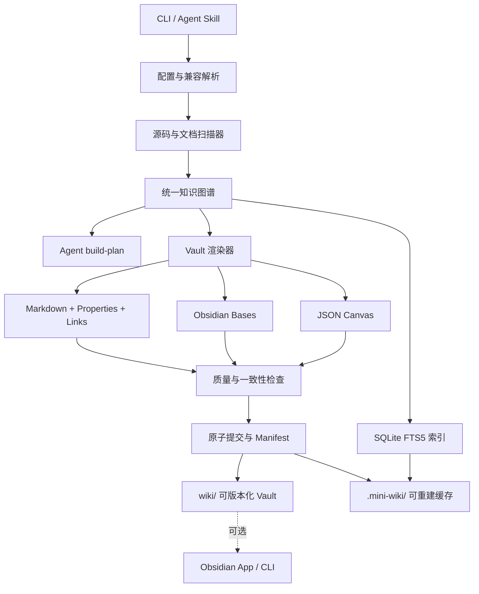
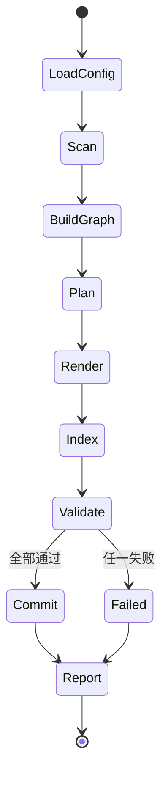

# Mini-Wiki Obsidian 知识网络升级设计

> 日期：2026-08-03
> 状态：已自审，待用户确认
> 目标版本：3.3.0
> 实施范围：P0 + P1 + P2

## 1. 决策摘要

本次工作升级的是 **Mini-Wiki 项目本身**，不是使用 Mini-Wiki 为本仓库生成一次性文档，也不是开发一个 Obsidian 替代品。

Mini-Wiki 将从“由 Agent 按说明生成长文档的一组脚本”升级为：

> 面向 AI Agent 的、确定性的“代码仓库 → 可版本化 Obsidian Vault”知识网络编译器。

核心决策如下：

1. 采用确定性编译架构：源码先形成统一知识图谱，再输出 Markdown、Properties、Links、Bases、Canvas 和搜索索引。
2. 新项目默认把可持久化知识库写入仓库根目录 `wiki/`；`.mini-wiki/` 仅保存配置、缓存、清单、暂存区和可恢复归档。
3. Markdown 是知识正文的事实来源；SQLite 搜索库和其他缓存必须可以重建。
4. Obsidian 是可选增强环境，而不是 Mini-Wiki 的运行依赖。
5. Mini-Wiki 保持双层产品形态：确定性的 Python 核心负责结构与一致性，Agent Skill 负责需要语义理解的专业正文。
6. 内部链接、源代码引用和构建产物不得包含用户机器的绝对路径。
7. 构建只更新机器管理区域，保护人工或 Agent 已确认的正文。
8. 旧版 `.mini-wiki/wiki/` 项目继续可用，并通过显式、可回滚的迁移命令升级。

## 2. 当前问题

当前实现已具备 `init`、`analyze`、`check`、`changes` 和插件管理 CLI，但尚未形成完整的生成与维护闭环：

- `init` 把文档创建在 `.mini-wiki/wiki/`，而项目又整体忽略 `.mini-wiki/`，知识资产默认无法进入版本控制。
- CLI 没有 `build`、`doctor`、`search`、`migrate` 和 Obsidian 集成命令。
- `check` 把 `.mini-wiki/wiki` 传给质量检查器后，检查器再次追加 `wiki`，实际检查路径错误。
- 默认扫描边界没有排除 `.agents/` 等工具目录，第三方 Skill 会污染项目分析、变更检测和文档映射。
- 变更映射是单个源码文件到单个文档的简化字典，无法表达模块、文档、符号之间的多对多关系。
- 现有文档规范使用 `file://` 绝对路径进行源码追溯，不可移植，也会暴露本机目录。
- 当前没有稳定文档 ID、统一 Properties、链接完整性检查、反向链接、孤立文档检测或确定性构建清单。
- 插件 ZIP 安装缺少路径穿越校验、大小限制、原子安装和默认禁用策略。
- 当前没有独立搜索能力、Obsidian Bases 视图、JSON Canvas 或可选 Obsidian 命令适配。

## 3. 目标与非目标

### 3.1 P0：可靠的知识库闭环

- 可靠扫描：统一排除规则、配置覆盖、`.gitignore` 兼容、符号与模块的稳定 ID。
- 可执行构建：新增 `build`，支持全量、增量、预览和机器可读输出。
- 可提交 Vault：默认输出 `wiki/`，缓存与状态保留在 `.mini-wiki/`。
- Obsidian Properties：为受管文档生成扁平、稳定、可查询的 YAML Frontmatter。
- 双向关系：生成内部链接，检查断链，计算反向链接与孤立节点。
- 可移植追溯：全部源码引用使用相对于 Vault 文档的 Markdown 路径。
- 安全增量更新：只替换机器管理区域；失败不留下半成品；旧文件可恢复。
- 插件安全：安全解压、清单校验、默认禁用、校验和、原子更新和回滚。

### 3.2 P1：搜索与 Bases

- 在 `.mini-wiki/cache/search.sqlite3` 建立可重建的 SQLite FTS5 索引。
- 新增 `search` CLI；没有 Obsidian 时仍可搜索标题、别名、标签、正文、源码和符号。
- 在 Vault 中生成 `.base` 文件，为模块、源码、文档质量和孤立节点提供原生 Obsidian Bases 视图。
- 搜索和 Bases 都使用同一套 Properties 与知识图谱，不维护第二套业务模型。

### 3.3 P2：Canvas 与可选 Obsidian 集成

- 生成符合 JSON Canvas 开放格式的系统架构、领域地图和源码追溯 Canvas。
- 使用稳定节点 ID 和确定性布局，避免每次构建产生无意义位置变化。
- 新增可选 Obsidian 探测、打开 Vault 和诊断能力。
- Obsidian 未安装、未运行或 CLI 版本不满足时，只降级相关增强能力，不影响构建和检查。

### 3.4 本次不做

- P3 的常驻 `watch` 服务、团队实时协作、远程同步或冲突解决。
- 向量数据库、Embedding 或联网语义搜索。
- 内置模型供应商和 API Key 管理；Mini-Wiki 继续由宿主 Agent 提供语义生成能力。
- 执行已安装插件中的任意脚本。插件仍然是供 Agent 阅读的指令与模板扩展。
- 自动修改用户的 `.obsidian/` 配置、社区插件或主题。

## 4. 产品边界：确定性核心 + Agent 写作层

Mini-Wiki 不能假设 CLI 自身拥有大模型。因此升级后明确分成两层：

### 4.1 确定性核心

Python 核心负责：

- 扫描源码和已有文档；
- 建立节点、关系和来源证据；
- 生成稳定 Properties、导航、关系区、Bases、Canvas；
- 更新搜索索引；
- 检查质量、断链、孤立节点、过期内容与格式；
- 保存变更清单，保证增量与可重复构建；
- 输出供 Agent 消费的 `build-plan.json`。

### 4.2 Agent Skill 写作层

`SKILL.md` 与中英文参考说明负责指导宿主 Agent：

- 读取项目分析与构建计划；
- 按业务领域生成或丰富专业正文；
- 提供架构解释、示例、边界条件和源码证据；
- 只编辑允许的正文区域；
- 再次运行 `build` 与 `check --strict` 收敛知识网络。

因此，`mini-wiki build` 的含义是“构建并收敛知识网络”，而不是伪装成一个没有模型的自动长文生成器。

## 5. 总体架构



### 5.1 建议新增的核心模块

| 模块 | 职责 |
|---|---|
| `config.py` | v3 配置读取、默认值、路径解析和旧配置兼容 |
| `models.py` | Node、Edge、SourceRef、DocumentRecord、BuildManifest 数据模型 |
| `scanner.py` | 统一扫描边界、Git 忽略规则、文件分类与哈希 |
| `knowledge_graph.py` | 稳定 ID、关系构建、反向链接、孤立节点和多对多映射 |
| `vault.py` | Vault 路径、Frontmatter、受管区域、相对链接和安全写入 |
| `build.py` | 编排全量/增量构建、暂存、校验、提交和报告 |
| `search_index.py` | FTS5 建库、增量更新、过滤、排序与降级搜索 |
| `bases.py` | `.base` 文件生成与结构校验 |
| `canvas.py` | JSON Canvas 节点、边和确定性布局 |
| `doctor.py` | 配置、路径、依赖、Vault、索引和 Obsidian 环境诊断 |
| `migration.py` | v2 → v3 检测、预览、备份、复制和回滚信息 |
| `obsidian.py` | 可选 CLI/URI 探测与显式打开操作 |
| `plugin_security.py` | 下载限制、安全解压、清单和校验和验证 |

现有分析、质量、变更检测与插件管理代码逐步调用这些公共模块，避免保留两套路径和排除逻辑。

## 6. 目录与配置契约

### 6.1 新项目目录

```text
project/
├── .mini-wiki/
│   ├── config.yaml
│   ├── meta.json
│   ├── manifest.json
│   ├── cache/
│   │   ├── analysis.json
│   │   ├── build-plan.json
│   │   ├── graph.json
│   │   └── search.sqlite3
│   ├── staging/
│   └── archive/
├── plugins/                       # 兼容现有、可版本化的 Agent 指令插件
└── wiki/
    ├── index.md
    ├── getting-started.md
    ├── architecture.md
    ├── knowledge-map.md
    ├── domains/
    │   └── <domain>/
    │       ├── _index.md
    │       └── <module>.md
    ├── reference/
    │   ├── api/
    │   └── source/
    ├── views/
    │   ├── modules.base
    │   ├── sources.base
    │   ├── quality.base
    │   └── orphans.base
    ├── canvas/
    │   ├── architecture.canvas
    │   ├── domains.canvas
    │   └── traceability.canvas
    └── assets/
```

仓库根 `.gitignore` 只需忽略 `.mini-wiki/`；`wiki/` 和 `plugins/` 默认不忽略。插件继续沿用现有根目录 `plugins/` 与 `_registry.yaml` 契约，避免升级后丢失已安装插件。Mini-Wiki 不自动修改已有根 `.gitignore`，但 `doctor` 会检测并给出明确修复建议。

### 6.2 v3 配置

```yaml
schema_version: 3

vault:
  path: wiki
  link_style: wikilink
  source_links: relative-markdown
  preserve_manual_content: true

generation:
  language: zh
  include_diagrams: true
  include_examples: true
  max_file_size: 100000

scan:
  respect_gitignore: true
  exclude:
    - .git
    - .mini-wiki
    - .agents
    - .agent
    - node_modules
    - dist
    - build
    - coverage
    - __pycache__
    - .venv
    - venv

search:
  enabled: true
  index_code_symbols: true

bases:
  enabled: true

canvas:
  enabled: true
  max_nodes: 200

obsidian:
  integration: auto
```

所有路径在加载时归一化并限制在项目根目录内。Vault 可以通过配置改名，但不得解析到项目根目录之外，除非未来增加明确的外部 Vault 授权机制。

## 7. 知识图谱与 Properties

### 7.1 节点

首期节点类型：

- `project`
- `domain`
- `module`
- `document`
- `source_file`
- `symbol`

稳定 ID 由类型和仓库相对标识生成，例如：

```text
mw:module:scripts/plugin-manager
mw:source:scripts/plugin_manager.py
mw:symbol:scripts/plugin_manager.py#install_plugin
mw:document:domains/core/plugin-system
```

重命名通过 Manifest 中的内容指纹和来源关系检测；无法安全判断时创建新 ID，并把旧文档列为待人工确认，而不是静默错误合并。

### 7.2 关系

首期关系类型：

- `contains`
- `documents`
- `defined_in`
- `depends_on`
- `references`
- `related_to`
- `generated_from`

每条关系至少包含 `source_id`、`target_id`、`type`；可追溯关系附带仓库相对文件、起止行和证据摘要。文档映射因此从一对一字典升级为多对多图。

### 7.3 文档 Properties

Obsidian Properties 采用扁平标量或列表，不写嵌套对象：

```yaml
---
id: mw:document:domains/core/plugin-system
title: 插件系统
type: module
status: generated
domain: core
aliases:
  - Plugin System
tags:
  - mini-wiki/module
  - domain/core
sources:
  - scripts/plugin_manager.py
source_hash: sha256:...
source_count: 1
freshness: current
orphan: false
backlink_count: 4
quality: professional
mini_wiki_version: 3.3.0
---
```

构建时间不写入受版本控制的文档，避免无业务变化时产生 diff。时间信息只进入 `.mini-wiki/meta.json` 和 Manifest。

## 8. 文档所有权与增量更新

每个 Mini-Wiki 管理的 Markdown 文件分成三部分：

```markdown
---
# Mini-Wiki 管理的 Properties
---

<!-- mini-wiki:generated:start -->
# 机器管理的导航、来源与关系内容
<!-- mini-wiki:generated:end -->

<!-- mini-wiki:content:start -->
# 人工或 Agent 维护的专业正文
<!-- mini-wiki:content:end -->
```

规则：

1. `build` 只能自动替换 Frontmatter 中 `mini_wiki_*` 及约定字段，以及 `generated` 区域。
2. `content` 区域必须原样保留，除非 Agent 正在执行明确的生成或升级任务。
3. 没有受管标记的现有 Markdown 默认视为用户文件，不覆盖；`migrate --adopt` 才会纳入管理。
4. Manifest 记录最近一次受管区域哈希、内容区域哈希和源文件哈希。
5. 构建在 `.mini-wiki/staging/` 完成，搜索索引也先写入暂存区；全部校验通过后，通过提交日志逐文件原子替换。
6. 失去来源的受管文件移动到 `.mini-wiki/archive/<run-id>/`，不直接删除。
7. 相同输入和配置必须生成字节级相同的受管产物。
8. 提交阶段先备份所有待替换目标；任一替换失败时按提交日志恢复 Vault、索引和 Manifest，避免只更新一部分产物。
9. 文件修改时间不参与内容或布局计算，确定性只依赖规范化内容、配置和稳定 ID。

## 9. 链接、反向链接与源码追溯

### 9.1 内部链接

- 默认使用 Obsidian Wikilink：`[[domains/core/plugin-system|插件系统]]`。
- 配置为 `markdown` 时生成标准相对 Markdown 链接。
- 所有链接从稳定文档 ID 映射到最终 Vault 路径，不在模板中手写目标路径。
- 文件重命名时由 Manifest 计算并重写受管区域中的链接；内容区域只报告，不自动改写。

### 9.2 源码链接

源码追溯统一为相对 Markdown 链接：

```markdown
[scripts/plugin_manager.py:42-88](../../../scripts/plugin_manager.py#L42-L88)
```

上例假设当前文档位于 `wiki/domains/core/`；实现必须从实际文档位置动态计算相对路径，不复制固定的 `../` 层级。行号显示在标签中；链接片段仅在目标渲染环境支持代码行锚点时启用。

禁止生成：

- `/Users/...` 等绝对路径；
- `file://...` URL；
- 指向项目根目录以外的路径；
- 无法验证存在性的行号范围。

### 9.3 检查能力

`check` 计算并报告：

- 未解析链接；
- 重复稳定 ID；
- 孤立受管文档和未覆盖源码；
- 缺失或越界的源码引用；
- Properties 类型错误；
- 来源哈希过期；
- 用户内容区域之外的冲突；
- Bases 和 Canvas 结构错误。

反向链接由图的反向边实时计算，无需在每个文档正文复制一份不可控列表；受管“相关文档”区域可显示排序后的关键反向关系。`index.md` 与领域 `_index.md` 等入口节点不判定为孤立；未覆盖源码默认是覆盖率警告，只有孤立的 Mini-Wiki 受管文档才在严格模式下失败。

## 10. 构建流程与命令

### 10.1 构建状态机



失败时保留诊断报告和暂存目录位置，但不更新 Vault 与 Manifest。

### 10.2 CLI 契约

| 命令 | 作用 |
|---|---|
| `mini-wiki init [PATH]` | 初始化 v3 配置、状态目录和 `wiki/` Vault |
| `mini-wiki build [PATH]` | 增量构建知识图谱、受管文档、Bases、Canvas 和索引 |
| `mini-wiki build --full` | 忽略旧缓存进行全量重建 |
| `mini-wiki build --dry-run` | 只报告将创建、修改、归档的文件 |
| `mini-wiki analyze [PATH]` | 输出统一扫描与项目结构分析 |
| `mini-wiki changes [PATH]` | 基于 Manifest 报告源码、文档和关系变化 |
| `mini-wiki check [PATH]` | 检查质量和网络一致性 |
| `mini-wiki check --strict` | 有断链、孤立受管文档、过期来源或结构错误时返回非零 |
| `mini-wiki doctor [PATH]` | 诊断配置、忽略规则、目录、索引、迁移和 Obsidian 环境 |
| `mini-wiki search QUERY [PATH]` | 搜索标题、别名、标签、正文、源码和符号 |
| `mini-wiki migrate [PATH]` | 预览 v2 → v3 迁移 |
| `mini-wiki migrate --apply` | 备份后执行迁移 |
| `mini-wiki obsidian status [PATH]` | 报告可选 App/CLI 集成状态 |
| `mini-wiki obsidian open [PATH]` | 用户显式请求时打开 Vault |

所有新增核心命令支持 `--json`，便于 Agent 获取结构化结果。现有命令保持兼容，错误必须通过退出码表达。

## 11. 搜索设计

### 11.1 索引范围

FTS5 表索引以下字段：

- `node_id`
- `title`
- `aliases`
- `tags`
- `body`
- `source_paths`
- `symbols`
- `node_type`

索引保存于 `.mini-wiki/cache/search.sqlite3`，不进入 Git。每次构建按节点内容哈希增量更新；Schema 版本变化时自动重建。中文检索不能依赖 SQLite 对连续 CJK 文本的默认分词：索引器会同时保存规范化原文与确定性的 CJK 单字、双字词项，查询端使用相同规范化规则，从而在 Python 3.10–3.12 自带 SQLite 上保持可预测行为。

### 11.2 查询行为

```text
mini-wiki search "plugin install" --type module --tag domain/core --limit 20
```

排序优先级：标题精确命中、别名、标签、正文、源码与符号。输出包含文档相对路径、匹配摘要和来源。若当前 Python 的 SQLite 不支持 FTS5，`doctor` 给出提示，`search` 自动退化为使用同一规范化器的内存词项匹配，功能可用但排序能力降低。

## 12. Bases 设计

`views/*.base` 直接查询同一套文档 Properties：

| Base | 默认视图 |
|---|---|
| `modules.base` | 按领域、类型、状态分组的模块表 |
| `sources.base` | 以文档为行展示来源列表、来源数量、哈希状态和质量 |
| `quality.base` | 按质量等级、来源新鲜度和标签筛选 |
| `orphans.base` | 没有入边或缺少来源关系的文档 |

生成器只使用 Obsidian 官方支持的 Bases YAML 结构。Base 文件同样是确定性产物，并在 `check` 中进行 YAML 解析、字段白名单和视图引用检查。

## 13. Canvas 设计

Canvas 使用开放 JSON Canvas 格式，仅生成 `nodes` 和 `edges` 等标准字段，不写 Mini-Wiki 私有结构。

### 13.1 三个默认 Canvas

- `architecture.canvas`：项目、领域、核心模块及依赖。
- `domains.canvas`：领域、子领域和对应文档。
- `traceability.canvas`：源码文件、符号和文档的追溯关系。

### 13.2 确定性布局

- 节点先按图层、类型、稳定 ID 排序。
- 使用固定网格尺寸和间距计算坐标。
- 相同节点集合产生相同坐标。
- 超过 `max_nodes` 时按领域聚合，生成摘要节点并在报告中说明省略数量。
- 节点引用 Vault 内文件，不复制文档正文。

## 14. Obsidian 可选集成

集成适配器只在用户运行 `mini-wiki obsidian ...` 时产生外部动作：

1. 探测 `obsidian` CLI 是否存在并读取可用版本信息。
2. CLI 可用时使用官方命令打开或验证 Vault。
3. CLI 不可用但系统支持 Obsidian URI 时，`open` 可在明确提示后使用 URI。
4. 两者都不可用时输出 Vault 绝对路径和手动打开说明，并返回可识别状态。

普通 `build`、`check` 和 `doctor` 不启动 Obsidian，不修改 `.obsidian/`，也不因缺少 Obsidian 而失败。

## 15. v2 → v3 兼容迁移

### 15.1 自动兼容

配置解析器检测以下旧状态：

- 存在 `.mini-wiki/wiki/`；
- 配置没有 `schema_version` 或版本小于 3；
- 没有显式 `vault.path`。

此时只读命令和原有 `check` 继续使用旧目录，并显示兼容模式提示。不会在普通构建中静默移动用户文件。

### 15.2 显式迁移

`migrate` 默认只预览。`migrate --apply` 执行：

1. 验证 `wiki/` 目标没有不可合并内容；
2. 把旧配置和文档复制到 `.mini-wiki/archive/<run-id>/v2-backup/`；
3. 将旧文档复制到根 `wiki/`，不删除旧目录；
4. 写入 v3 配置并生成 Manifest；
5. 把无标记旧 Markdown 保持为用户文件；
6. 运行构建与严格检查；
7. 输出恢复步骤。

只有用户确认迁移成功后，才可以自行清理旧目录。

## 16. 插件安全

插件安装必须满足：

- 默认只接受本地目录、HTTPS URL 或规范化 GitHub 地址；
- 下载和解压大小有上限；
- 拒绝绝对路径、`..`、符号链接和 ZIP 路径穿越；
- 临时目录由系统安全创建，不复用固定 `_temp.zip`；
- 原生 `PLUGIN.md` 的 YAML Frontmatter 必须通过 Schema、名称和版本校验；标准 `SKILL.md` 校验名称与描述，缺失版本时使用兼容默认值；不再把任意 README 自动包装成插件；
- 安装记录来源、SHA-256、版本与时间；
- 新安装的第三方插件默认禁用，需显式 `enable`；现有内置插件状态保持兼容；
- 已存在目标默认拒绝覆盖；更新在暂存区验证后原子替换；
- 失败保留原版本并清理不完整暂存；
- Mini-Wiki 和宿主 Agent 都不得自动执行插件脚本。

## 17. 错误处理与可观测性

所有核心操作返回统一结果：

```json
{
  "success": false,
  "code": "LINK_TARGET_MISSING",
  "message": "2 个内部链接无法解析",
  "details": [],
  "changed": [],
  "warnings": []
}
```

要求：

- 人类输出简洁，`--json` 输出稳定、可供 Agent 解析；
- 配置错误、输入错误、校验错误和环境降级使用不同错误码；
- 普通警告不隐藏，严格模式下指定警告升级为失败；
- 持久化日志和 `--json` 输出默认使用仓库相对路径，不打印令牌、下载凭据或文档私密内容；只有用户显式执行 `obsidian open` 时，交互提示才可显示要打开的本地 Vault 路径；
- 写操作前报告目标，写操作后报告实际变更。

## 18. 测试策略

所有生产代码遵循 Red → Green → Refactor：先写失败测试并确认失败原因，再实现最小功能。

### 18.1 单元测试

- 配置默认值、路径越界和 v2 兼容；
- 排除规则与 `.gitignore`；
- 稳定 ID、节点与多对多关系；
- Frontmatter、受管区域和人工内容保留；
- Wikilink、Markdown 链接与相对源码路径；
- 断链、反向链接、孤立节点和过期来源；
- FTS5 索引与降级搜索；
- 中英文混合查询与 CJK 双字词项规范化；
- Bases YAML；
- Canvas Schema 与确定性坐标；
- ZIP 路径穿越、符号链接、超限与回滚；
- 迁移预览、应用和重复执行幂等性。

### 18.2 集成测试

使用临时微型仓库验证：

1. `init → build → check --strict → search` 完整闭环；
2. 连续两次构建不产生文件差异；
3. 修改一个源文件只更新相关节点与索引；
4. 人工内容在全量构建后字节不变；
5. 断链和孤立文档导致严格检查失败；
6. v2 项目迁移后旧内容、备份和新 Vault 都存在；
7. 没有 Obsidian 时全部核心门禁仍通过。
8. 模拟提交阶段失败时，Vault、索引和 Manifest 都恢复到构建前状态。

### 18.3 质量门禁

- `pytest --cov=scripts --cov-report=term-missing`
- `ruff check scripts tests`
- `ruff format --check scripts tests`
- `mypy scripts --ignore-missing-imports`
- CLI 端到端 smoke test
- `git diff --check`

CI Python 版本继续覆盖 3.10、3.11、3.12。

## 19. 分阶段交付顺序

虽然 P0、P1、P2 都纳入本轮，但按可验证依赖顺序实施：

### 阶段一：P0 基础闭环

1. 配置、路径和扫描边界；
2. 数据模型和知识图谱；
3. 新目录初始化与 v2 兼容；
4. Vault 渲染、Properties、链接与受管区域；
5. `build`、`check --strict`、`doctor`；
6. 原子构建、Manifest 和插件安全。

### 阶段二：P1 检索视图

1. FTS5 索引和降级实现；
2. `search` 命令；
3. 四个 Bases 视图；
4. 搜索、Properties 与图谱一致性校验。

### 阶段三：P2 空间视图与集成

1. JSON Canvas 生成器；
2. 三个默认 Canvas；
3. Obsidian 状态与打开适配；
4. 完整迁移、Skill、README 和发布文档。

每个阶段单独通过测试与静态门禁后再进入下一阶段，不以一次大提交混合全部风险。

## 20. 验收标准

本次升级完成必须同时满足：

1. 新项目执行 `init` 后得到可提交、可直接作为 Obsidian Vault 打开的 `wiki/`。
2. `build` 能完成知识图谱、Properties、内部链接、Bases、Canvas 和搜索索引构建。
3. 对相同输入连续构建两次，第二次报告零业务变更，受管文件字节不变。
4. 人工/Agent 正文不会被普通构建覆盖。
5. 源码引用全部为有效相对路径，产物中不存在绝对用户目录或 `file://`。
6. `check --strict` 能发现断链、重复 ID、孤立受管文档、过期来源、非法 Base 和 Canvas。
7. `search` 在无 Obsidian 环境中可用，能查询中英文混合内容，并支持类型、标签和数量过滤。
8. Obsidian 能原生读取 Properties、Bases 和 Canvas；没有 Obsidian 时核心流程不失败。
9. v2 项目可以先预览、再备份迁移；迁移失败不破坏原目录。
10. 恶意 ZIP 路径穿越和超限插件安装被测试证明会拒绝。
11. Skill 的中英文说明、README、CLI `--help` 和配置示例与实际行为一致。
12. Python 3.10–3.12 测试、Ruff、Mypy 和端到端 smoke test 全部通过。

## 21. 参考标准

- [Obsidian 数据存储](https://obsidian.md/help/data-storage)
- [Obsidian 内部链接](https://obsidian.md/help/Linking%2Bnotes%2Band%2Bfiles/Internal%2Blinks)
- [Obsidian Properties](https://obsidian.md/help/Editing%2Band%2Bformatting/Properties)
- [Obsidian Backlinks](https://obsidian.md/help/Plugins/Backlinks)
- [Obsidian Search](https://obsidian.md/help/Plugins/Search)
- [Obsidian Bases](https://obsidian.md/help/bases/views)
- [Obsidian Canvas](https://obsidian.md/help/Plugins/Canvas)
- [JSON Canvas 规范](https://jsoncanvas.org/spec/1.0/)
- [Obsidian CLI](https://obsidian.md/help/cli)
