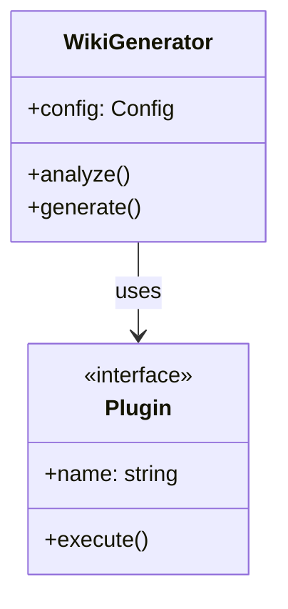
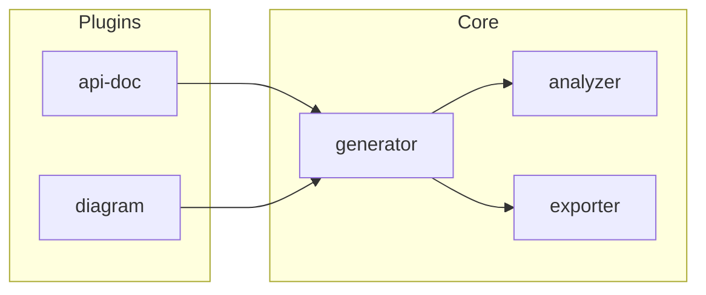

# Diagram Plus / 图表增强器

扩展 mini-wiki 的图表生成能力，自动分析代码结构并生成多种类型的 Mermaid 图表。

## 功能特性 / Features

### 1. 支持的图表类型 / Supported Diagrams

| 图表类型 | 用途 | 自动生成 |
|---------|------|----------|
| `flowchart` | 流程图 | ✅ |
| `sequenceDiagram` | 时序图 | ✅ |
| `classDiagram` | 类图 | ✅ |
| `erDiagram` | 实体关系图 | ✅ |
| `stateDiagram` | 状态图 | ⚙️ 需配置 |
| `gantt` | 甘特图 | ❌ 手动 |
| `pie` | 饼图 | ⚙️ 统计数据 |
| `mindmap` | 思维导图 | ✅ |
| `timeline` | 时间线 | ⚙️ CHANGELOG |
| `gitGraph` | Git 图 | ✅ |

### 2. 自动分析 / Auto Analysis

#### 类关系图 (Class Diagram)


#### 模块依赖图 (Module Dependencies)


#### 调用时序图 (Sequence Diagram)
自动从函数调用链生成时序图。

### 3. 智能布局 / Smart Layout

- 自动选择最佳图表方向 (TB/LR/RL/BT)
- 模块分组 (subgraph)
- 节点颜色编码
- 连接线样式优化

## Hooks

### after_analyze

分析项目后：

1. 扫描类和接口定义
2. 解析 import/require 依赖
3. 识别函数调用关系
4. 检测状态机模式
5. 保存到 `cache/diagram-data.json`

### before_generate

生成前：

1. 根据分析数据选择图表类型
2. 生成 Mermaid 代码
3. 应用布局优化
4. 注入到文档模板

## 配置 / Configuration

在 `.mini-wiki/config.yaml` 中添加：

```yaml
plugins:
  diagram-plus:
    # 启用的图表类型
    diagrams:
      - class
      - flowchart
      - sequence
      - er
      - mindmap
    
    # 默认方向
    default_direction: TB  # TB | LR | RL | BT
    
    # 主题
    theme: default  # default | dark | forest | neutral
    
    # 最大节点数（防止图表过大）
    max_nodes: 50
    
    # 是否显示私有成员
    show_private: false
    
    # 是否生成交互式图表
    interactive: false
```

## 输出示例 / Output Example

在 `architecture.md` 中自动插入：

```markdown
## 系统架构

### 模块依赖

​```mermaid
flowchart TB
    subgraph Core["核心模块"]
        Generator["WikiGenerator"]
        Analyzer["ProjectAnalyzer"]
        Cache["CacheManager"]
    end
    
    subgraph Plugins["插件系统"]
        PluginMgr["PluginManager"]
        Hooks["HookRegistry"]
    end
    
    Generator --> Analyzer
    Generator --> Cache
    Generator --> PluginMgr
    PluginMgr --> Hooks
    
    style Generator fill:#e1f5fe
    style PluginMgr fill:#fff3e0
​```

### 类关系图

​```mermaid
classDiagram
    class IPlugin {
        <<interface>>
        +name: string
        +hooks: string[]
        +execute(context): void
    }
    
    class ApiDocEnhancer {
        +name = "api-doc-enhancer"
        +extractDocs()
    }
    
    class DiagramPlus {
        +name = "diagram-plus"
        +generateDiagrams()
    }
    
    IPlugin <|.. ApiDocEnhancer
    IPlugin <|.. DiagramPlus
​```
```

## 命令 / Commands

```bash
# 重新生成所有图表
python scripts/diagram_generator.py regenerate

# 生成指定类型图表
python scripts/diagram_generator.py --type class

# 预览图表
python scripts/diagram_generator.py preview
```
