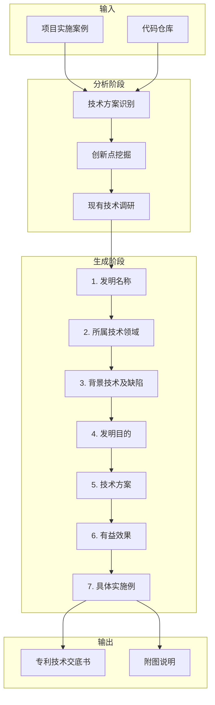

# 专利技术交底书生成器 / Patent Disclosure Generator

> **核心价值**：基于资深专利代理人的专业经验，从项目实施案例自动生成符合专利撰写规范的技术交底书。

## 📋 专利撰写核心原则

### 1. 通用性与抽象性
- 技术方案必须**高度抽象**，能够涵盖解决**同类问题的通用方法**
- 避免局限于具体实施案例的特定细节
- 使用**上位概念**替代**下位概念**扩大保护范围

### 2. 充分公开性
- 描述清楚、完整、准确，披露所有必要技术特征
- 确保本领域技术人员**无需创造性劳动**即可实现

### 3. 法律规范性
- 符合《专利法实施细则》和《专利审查指南》要求
- 符合国际专利分类（IPC）标准
- 避免禁用词汇（人名、地名、商标、宣传语等）

---

## 🔄 标准工作流程



### 快速流程（推荐）

对于已有明确技术方案的场景：

```
实施案例 → 发明名称 → 发明目的 → 技术方案 → 有益效果 → 实施例 → 交底书
```

---

## 📝 专利要素生成规范

### 1. 发明名称 / Invention Title

**生成规则**：
| 要求 | 说明 |
|------|------|
| 类型明确 | 必须包含"方法"、"系统"、"装置"等类型词 |
| 通用抽象 | 涵盖解决同类问题的通用方法 |
| 技术术语 | 使用所属领域通用的规范术语 |
| 长度限制 | **15-25字**，特殊情况不超过40字 |
| 禁用词汇 | ❌ 人名、地名、商标、型号、宣传语 |

**命名结构**：
- `一种[用于解决某问题的]方法`
- `一种[实现某功能的]系统`
- `一种[对象]的[处理]装置`

**示例**：
```
✅ 一种用户兴趣预测方法
✅ 一种基于深度学习的图像识别系统
❌ 一种高效的智能推荐算法（含宣传语）
❌ 一种基于GPT-4的文档生成方法（含商标）
```

---

### 2. 所属技术领域 / Technical Field

**生成规则**：
- 符合国际专利分类（IPC）标准
- 准确且不过于宽泛
- 格式：`本发明涉及[技术领域]，尤其涉及[更具体的子领域]`

**示例**：
```
本发明涉及一种交通流预测方法，尤其涉及基于图神经网络的视频数据分析技术领域。
```

---

### 3. 背景技术及其缺陷 / Background Art and Defects

**生成结构**：

```markdown
## 背景技术
[描述最接近的现有技术及其工作原理/实现方法]

## 现有技术缺陷及其原因
[客观指出现有技术存在的具体技术问题，并分析原因]
```

**撰写要点**：
| 要点 | 说明 |
|------|------|
| 识别最接近技术 | 与本发明最相关的现有技术方案 |
| 客观评价缺陷 | 指出技术问题，非商业问题 |
| 分析缺陷原因 | 为发明目的提供逻辑铺垫 |
| 避免诽谤 | 使用"存在问题"而非"劣势" |

---

### 4. 发明目的 / Inventive Purpose

**生成规则**：
- 聚焦**通用技术问题**，而非特定场景
- 源于背景技术缺陷
- 技术性表述，避免解决方案或效果

**推荐表述结构**：
- `为了解决现有[某一类方法]存在的[具体技术问题]，本发明旨在提供一种[通用目的]的方法。`
- `本发明的目的在于提供一种[克服现有技术某缺陷的]方法。`

**示例**：
```
为了解决现有自动化分拣系统在处理不规则或受损包裹时准确率低、易出错及人工干预频繁的技术问题，本发明旨在提供一种提高分拣准确性及效率的自动化分拣方法。
```

---

### 5. 技术方案 / Technical Solution（核心）

**生成规则**：

| 原则 | 要求 |
|------|------|
| **详尽步骤** | 清晰的步骤形式，每步详细描述"如何做" |
| **极端通用性** | 脱离特定场景、具体数据、具体设备型号 |
| **充分公开** | 本领域技术人员无需创造性劳动即可实现 |
| **排除产品细节** | 仅关注方法步骤和原理 |

**步骤描述内容**：
- **操作流程**：具体实施过程、顺序、逻辑关系
- **数据处理**：获取、输入、预处理、分析、计算、输出
- **参数设定**：设定依据、调整方式、范围或类型
- **决策逻辑**：判断依据或条件

**输出格式**：
```markdown
本发明提供一种[发明名称]方法，包括以下步骤：

1. **[步骤名称]：** [详细描述该步骤的具体操作、处理逻辑、输入输出]

2. **[步骤名称]：** [详细描述...]

3. **[步骤名称]：** [详细描述...]

本发明方法适用于[适用场景]，能够[核心价值]。
```

**关键指令**：
> ⚠️ 实施案例中的具体举例（如特定算法代码、特定材料配比、特定软件名称等）**绝不应被视为**通用技术方案的必要步骤。这些仅作为**说明性示例**，应将其**抽象为更通用的技术概念**。

---

### 6. 有益效果 / Beneficial Effects

**生成规则**：
- **直接对应发明目的**：每项效果针对一个技术问题
- **源于技术方案**：从步骤推导技术优势
- **客观技术性**：避免商业宣传语
- **抽象通用化**：避免具体数值

**输出格式**：
```markdown
本发明具有如下有益效果：

1. **[效果标题]：** [详细说明该效果如何源于技术方案，带来什么技术改进]

2. **[效果标题]：** [详细说明...]

3. **[效果标题]：** [详细说明...]
```

**量化词汇**：
- ✅ "显著提高"、"大幅降低"、"有效提升"、"明显改善"
- ❌ "市场领先"、"用户体验极佳"、"性价比最高"

---

### 7. 具体实施例 / Embodiments

**生成规则**：

| 要求 | 说明 |
|------|------|
| **具象化** | 将通用步骤转化为具体可落地细节 |
| **可重复性** | 技术人员可根据描述重复实施 |
| **体现效果** | 展示发明目的和有益效果 |
| **多个实施例** | 2-3个不同场景的实施例，扩大保护范围 |

**实施例内容**：
- 具体的操作流程和参数值
- 所用工具/设备/数据类型/模型实例
- 操作前后的对比、性能数据
- 应用场景和效果验证

**输出格式**：
```markdown
下面结合具体实施例对本发明作进一步详细说明：

## 实施例一：[场景标题]

本实施例旨在说明本发明在[应用场景]中的应用。

1. **[步骤名称]：** [具体实现细节，包括具体设备型号、参数值、条件等]

2. **[步骤名称]：** [具体实现细节...]

3. **[步骤名称]：** [具体实现细节...]

经实际验证，本实施例[效果数据]。

## 实施例二：[另一场景标题]
...
```

---

## 📄 完整专利交底书格式

**输出格式**（符合专利局规范）：

```
[0001] 发明名称：[发明名称]

[0002] 技术领域
本发明涉及[技术领域]，具体涉及一种[具体子领域]。

[0003] 背景技术
[现有技术描述...]
然而，现有技术存在以下问题：
1. [问题一及原因]
2. [问题二及原因]

[0004] 发明目的
本发明的目的是提供一种[发明名称]，解决现有技术中存在的[技术问题]。

[0005] 技术方案
为了解决上述技术问题，本发明提供了一种[发明名称]，其技术方案如下：
步骤1：[详细描述]
步骤2：[详细描述]
...

[0006] 有益效果
与现有技术相比，本发明具有以下有益效果：
（1）[效果一]
（2）[效果二]
（3）[效果三]

[0007] 附图说明
图1为[图名]；
图2为[图名]；
...

[0008] 具体实施方式
下面结合附图对本发明的具体实施方式进行详细说明。
[实施例内容...]
```

---

## 🔌 Hooks 指引协议

### after_analyze

1. **技术方案识别**：从代码中识别核心算法和处理流程
2. **创新点挖掘**：识别区别于现有技术的关键特征
3. **现有技术调研**：推断相关领域的现有技术及其缺陷

### before_generate

1. **变量准备**：准备专利各要素所需的输入变量
2. **模板选择**：根据发明类型选择合适的生成模板

### after_generate

1. **交底书整合**：将各要素整合为完整的专利交底书
2. **附图生成**：生成 Mermaid 格式的流程图和结构图
3. **形式审查**：检查格式规范性和内容完整性

---

## ⚙️ 配置 / Configuration

```yaml
plugins:
  patent-generator:
    # 目标专利局
    jurisdiction: CN              # CN (中国) | US (美国) | EP (欧洲) | PCT (国际)
    
    # 发明类型
    invention_type: method        # method (方法) | system (系统) | apparatus (装置)
    
    # 生成模式
    generation_mode: standard     # quick (快速) | standard (标准) | full (完整)
    
    # 实施例数量
    embodiment_count: 2           # 建议 2-3 个
    
    # 术语抽象化字典（用于上位化）
    term_abstraction:
      "Redis": "高速缓存存储装置"
      "MySQL": "关系型数据库存储系统"
      "React": "用户界面渲染框架"
      "TensorFlow": "深度学习计算框架"
      "Kubernetes": "容器编排管理系统"
    
    # 禁用词汇检查
    forbidden_terms:
      - trademarks: true          # 检查商标
      - person_names: true        # 检查人名
      - promotional: true         # 检查宣传语
    
    # 发明人信息
    inventors:
      - name: "张三"
        citizenship: "CN"
      - name: "李四"
        citizenship: "CN"
```

---

## 📁 输出文件结构

```
.mini-wiki/patent/
├── disclosure.md           # 完整专利技术交底书
├── elements/               # 各要素分离文件
│   ├── 1-title.md          # 发明名称
│   ├── 2-field.md          # 所属技术领域
│   ├── 3-background.md     # 背景技术及缺陷
│   ├── 4-purpose.md        # 发明目的
│   ├── 5-solution.md       # 技术方案
│   ├── 6-effects.md        # 有益效果
│   └── 7-embodiments.md    # 具体实施例
├── figures/                # 附图
│   ├── fig1-system.mmd     # 系统架构图 (Mermaid)
│   ├── fig2-flowchart.mmd  # 核心流程图 (Mermaid)
│   └── fig3-dataflow.mmd   # 数据流图 (Mermaid)
└── review/                 # 审查报告
    ├── checklist.md        # 形式审查清单
    └── suggestions.md      # 改进建议
```

---

## 手动命令（仅供人工参考）

出于安全模型（指令型插件，不执行代码），此处不包含命令示例。如需 CLI 用法，请参考项目 README。

---

## ✅ 最佳实践

### 推荐做法

1. **详细的实施案例**：提供尽可能详细的技术实现描述
2. **多个实施例**：覆盖不同应用场景，扩大保护范围
3. **术语抽象化**：使用通用术语替代特定产品名称
4. **人工审核**：AI 生成后需专业人员审核

### 避免做法

1. **具体产品名称**：避免直接使用商标或型号
2. **宣传性语言**：避免"高效"、"智能"、"创新"等主观词汇
3. **过于具体的数值**：技术方案中避免硬编码参数
4. **遗漏关键步骤**：确保步骤完整，可被复现

---

## 📚 参考资源

- [专利法实施细则](http://www.sipo.gov.cn/zcfg/flfg/zlflfg/)
- [专利审查指南](http://www.sipo.gov.cn/zcfg/zcjd/)
- [国际专利分类（IPC）](https://www.wipo.int/classifications/ipc/)
- [专利撰写 Prompt 模板](https://gitee.com/trsoliu/patent)
