# Repo Analytics / 仓库分析器

深度挖掘 Git 仓库历史数据，生成可视化的统计报告。

## 功能特性 / Features

### 1. 贡献者画像 (Contributor Profile)

- **核心贡献者榜单**: 按照 Commit 数量和代码行数变动排序。
- **活跃度分析**: 识别每个贡献者的活跃时段（工作日/周末，早晨/深夜）。

### 2. 代码演进 (Code Evolution)

- **代码频率图 (Code Frequency)**: 生成 Mermaid 趋势图，展示每周的代码增加/删除量。
- **提交热力图 (Commit Heatmap)**: 清晰展示项目的开发节奏和冲刺周期。

### 3. 文件热度 (File Churn)

- **修改热点**: 识别修改频率最高的文件（通常是潜在的技术债务高发区）。
- **关联分析**: 发现经常一起修改的文件对（Coupling Analysis）。

## Hooks

### after_analyze

执行统计分析：
1. `git log --numstat` 解析代码行数变动。
2. `git shortlog` 统计贡献者分布。
3. 计算文件修改频率。
4. 生成 `cache/repo-stats.json`。

### after_generate

Wiki 生成阶段：
1. 读取统计数据。
2. 自动绘制 Mermaid 图表（饼图、柱状图、折线图）。
3. 生成 `wiki/stats/repository.md` 报告页面。

## 配置 / Configuration

在 `.mini-wiki/config.yaml` 中添加：

```yaml
plugins:
  repo-analytics:
    # 统计时间跨度 (天)
    days: 365
    
    # 忽略的作者 (如机器人)
    exclude_authors:
      - "dependabot[bot]"
      - "ci-bot"
      
    # 忽略的文件路径
    exclude_paths:
      - "dist/"
      - "yarn.lock"
      - "package-lock.json"
      
    # 可视化设置
    charts:
      heatmap: true
      contributors: true
      churn: true
```

## 输出示例 / Output Example

### 项目统计报告 (`stats/repository.md`)

```markdown
# 📊 项目统计报告

> Generated at 2024-01-28

## 👥 贡献者概览

| 排名 | 作者 | 提交数 | 变更行数 | 活跃度 |
|------|------|--------|----------|--------|
| 1 | Alice | 150 | +12,500 / -3,200 | 🔥🔥🔥 |
| 2 | Bob | 85 | +4,100 / -2,000 | 🔥🔥 |

## 📈 代码频率 (Code Frequency)



```mermaid
xychart-beta
    title "Weekly Code Additions & Deletions"
    x-axis ["W1", "W2", "W3", "W4"]
    bar [+500, +200, +800, +150]
    bar [-100, -50, -300, -20]
```

## 🔥 热点文件 (Top Churn)

以下文件修改最为频繁，建议重点关注代码质量：

1. `src/core/Engine.ts` (45 commits)
2. `README.md` (32 commits)
```

## 命令 / Commands

```bash
# 生成统计报告
python scripts/plugin_manager.py run repo-analytics report

# 导出原始数据 JSON
python scripts/plugin_manager.py run repo-analytics export-json
```
