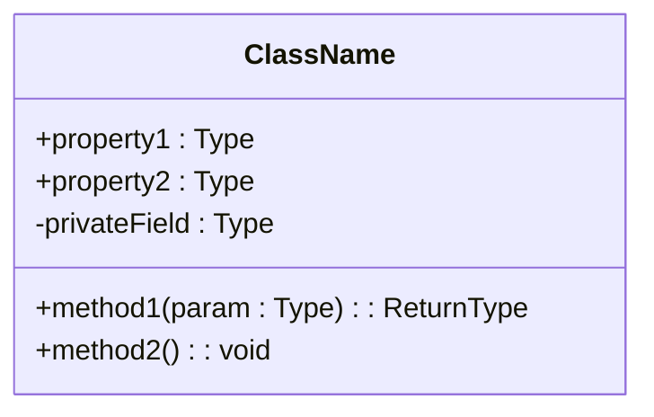
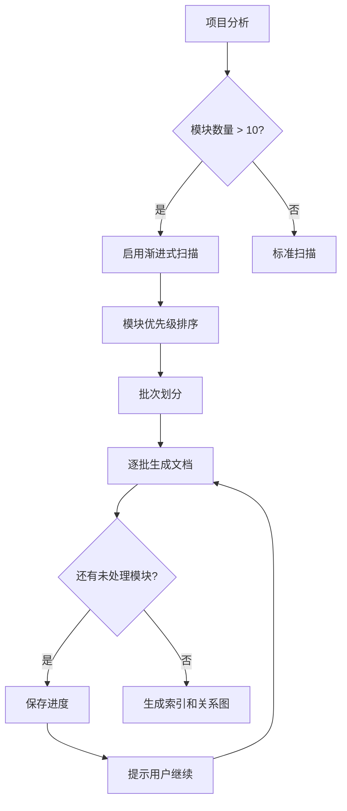
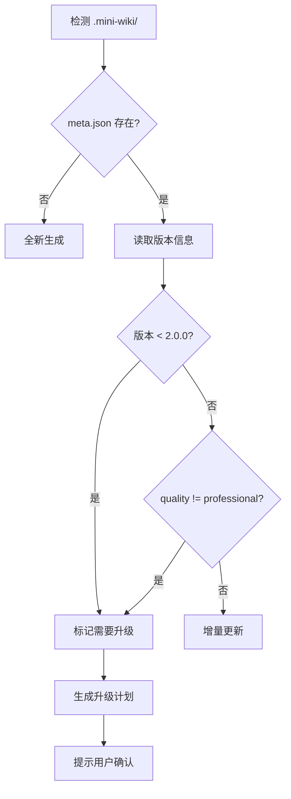

# Wiki 自动生成技能（中文版）

本文件为中文用户提供技能使用说明。

> **核心原则**：生成的文档必须 **详细、结构化、有图表、相互关联**，达到企业级技术文档标准。

## 📋 文档质量标准

**关键要求**：所有生成的文档必须满足以下标准：

### 内容深度
- 每个主题必须有**完整的上下文**——不能只有简单列表或骨架内容
- 描述必须**详细且具体**——解释 WHY（为什么）和 HOW（如何实现）
- 必须包含**可运行的代码示例**和预期输出
- 必须记录**边界情况、警告、常见陷阱**

### 结构要求
- 使用**层级标题**（H2/H3/H4）建立清晰的信息架构
- 重要概念用**表格**呈现便于快速参考
- 流程用 **Mermaid 图表**可视化
- 文档间通过**交叉链接**建立关联

### 图表要求（每个文档至少 2-3 个）
| 内容类型 | 图表类型 |
|---------|----------|
| 架构 | `flowchart TB` + subgraph |
| 数据/调用流 | `sequenceDiagram` |
| 状态变化 | `stateDiagram-v2` |
| **类/接口** | `classDiagram` 含属性+方法 |
| 依赖关系 | `flowchart LR` |

### 🔴 强制要求：源码追溯

**每个章节末尾必须包含源码引用**：

```markdown
**Section sources**
- [filename.ts](file://path/to/file.ts#L1-L50)
- [another.ts](file://path/to/another.ts#L20-L80)

**Diagram sources**
- [architecture.ts](file://src/architecture.ts#L1-L100)
```

### 🔴 强制要求：模块文档结构

每个模块文档必须包含以下章节（最少 200+ 行）：

| 章节 | 必需内容 |
|------|----------|
| **概述** | 完整介绍、核心价值、在架构中的位置图 |
| **核心功能** | 功能表格 + classDiagram 类图（含属性+方法） |
| **目录结构** | 文件树 + 文件职责说明表 |
| **使用示例** | 3+ 个完整可运行代码示例 |
| **最佳实践** | 推荐做法 + 应避免做法 + 原因 |
| **性能优化** | 性能技巧、优化建议 |
| **错误处理/调试** | 常见错误、调试技巧 |
| **依赖关系** | 依赖图 + 被依赖说明 |
| **相关文档** | 交叉链接 |

### 🔴 强制要求：核心类的 classDiagram

对每个核心类/接口，生成详细的类图：



### 文档关联
- 每个文档必须有**"相关文档"**章节
- 模块文档链接到：架构位置、API 参考、依赖项
- API 文档链接到：父模块、使用示例、类型定义

---

## 输出目录结构

```
.mini-wiki/
├── config.yaml              # 配置
├── meta.json                # 元数据
├── cache/                   # 增量更新缓存
├── wiki/                    # 主 Wiki 内容
│   ├── index.md             # 项目首页概览
│   ├── architecture.md      # 系统架构（含图表）
│   ├── getting-started.md   # 快速开始指南
│   ├── doc-map.md           # 文档关系图谱
│   ├── modules/             # 模块文档
│   │   ├── _index.md        # 模块索引
│   │   └── <module>.md      # 各模块详细文档
│   ├── api/                 # API 参考
│   │   ├── _index.md        # API 索引
│   │   └── <module>.md      # 模块 API 文档
│   └── assets/              # 图片和图表
└── i18n/                    # 多语言版本
    ├── en/
    └── zh/
```

## 执行流程

### 1. 初始化检查

检查 `.mini-wiki/` 是否存在：
- **不存在**: 运行 `scripts/init_wiki.py` 创建目录结构
- **存在**: 读取 `config.yaml` 和缓存，执行增量更新

### 2. 插件发现

检查 `plugins/` 目录中已安装的插件：
1. 读取 `plugins/_registry.yaml` 获取已启用插件
2. 读取每个插件的 `PLUGIN.md` 清单
3. 注册钩子：`on_init`, `after_analyze`, `before_generate`, `after_generate`

### 3. 项目分析（深度）

运行 `scripts/analyze_project.py` 或手动分析：

1. **识别技术栈**: 检查 package.json, requirements.txt 等
2. **发现入口文件**: src/index.ts, main.py 等
3. **识别模块**: 扫描 src/ 目录结构
4. **发现现有文档**: README.md, CHANGELOG.md 等
5. **执行 `after_analyze` 钩子**

保存结构到 `cache/structure.json`。

### 4. 深度代码分析（新增 - 关键步骤）

**重要**：对于每个模块，必须读取并分析实际源代码：

1. **读取源文件**：使用 read_file 工具读取关键源代码文件
2. **理解代码语义**：分析代码的功能，而不仅仅是结构
3. **提取详细信息**：
   - 函数目的、参数、返回值、副作用
   - 类层次结构和关系
   - 数据流和状态管理
   - 错误处理模式
   - 使用的设计模式
4. **识别关系**：模块依赖、调用图、数据流

> 📖 参见 `references/prompts.md` → "代码深度分析" 获取分析提示词模板

### 5. 变更检测

运行 `scripts/detect_changes.py` 对比文件校验和：
- 新增文件 → 生成文档
- 修改文件 → 更新文档
- 删除文件 → 标记废弃

### 6. 内容生成（专业级）

执行 `before_generate` 钩子，然后按照**严格的质量标准**生成内容：

#### 6.1 首页 (`index.md`)
必须包含：
- 项目徽章和一句话描述
- **2-3 段**详细介绍（不只是列表）
- 架构预览图（Mermaid flowchart）
- 文档导航表格（含目标读者）
- 核心特性表格（链接到模块）
- 快速开始代码示例（含预期输出）
- 项目统计表格
- 模块概览表格（含链接）

#### 6.2 架构文档 (`architecture.md`)
必须包含：
- 执行摘要（定位、技术概览、架构风格）
- **系统架构图**（Mermaid flowchart TB + subgraph）
- 技术栈表格（版本和选型理由）
- **模块依赖图**（Mermaid flowchart）
- 详细模块描述（职责和接口）
- **数据流图**（Mermaid sequenceDiagram）
- **状态管理图**（如适用）
- 目录结构说明
- 设计模式和原则
- 扩展指南

#### 6.3 模块文档 (`modules/<name>.md`)
每个模块文档必须包含（至少 16 个章节）：
1. 模块概述（2-3 段，不是 2-3 句）
2. 核心价值主张
3. **架构位置图**（高亮当前模块）
4. 功能表格（关联 API）
5. 文件结构（职责说明）
6. **核心工作流图**（Mermaid flowchart）
7. **状态图**（如适用）
8. 公开 API 概览表格
9. 详细 API 文档（签名、参数、返回值、示例）
10. 类型定义（字段表格）
11. 快速开始代码
12. **3+ 使用示例**（含场景说明）
13. 最佳实践（该做和不该做）
14. 设计决策和权衡
15. **依赖关系图**
16. 相关文档链接

#### 6.4 API 文档 (`api/<name>.md`)
每个 API 文档必须包含：
- 模块概述（含导入示例）
- API 概览表格
- 类型定义（属性表格）
- 每个函数：
  - 一句话 + 详细描述（3+ 句）
  - 函数签名
  - 参数表格（约束和默认值）
  - 返回值（可能的情况）
  - 异常表格
  - **3 个代码示例**（基础、进阶、错误处理）
  - 警告和提示
  - 相关 API
- 类：类图、构造函数、属性、方法
- 使用模式（2-3 个完整场景）
- FAQ 章节
- 相关文档

#### 6.5 快速开始 (`getting-started.md`)
必须包含：
- 前置条件表格（版本要求）
- 多种安装方式
- 配置文件说明
- 分步骤的第一个示例
- 下一步表格
- 常见问题 FAQ

#### 6.6 文档地图 (`doc-map.md`)
必须包含：
- **文档关系图**（Mermaid flowchart）
- 按角色的阅读路径推荐
- 完整文档索引
- 模块依赖矩阵

执行 `after_generate` 钩子。

### 7. 代码链接

为代码块添加源码链接：
```markdown
### `functionName` [📄](file:///path/to/file.ts#L42)
```

### 8. 保存

- 写入 wiki 文件到 `.mini-wiki/wiki/`
- 更新 `cache/checksums.json`
- 更新 `meta.json` 时间戳

---

## 🚀 大型项目渐进式扫描

**问题**：大型项目时，AI 可能只生成少量文档而没有全面覆盖所有模块。

### 触发条件

当项目满足以下任一条件时，必须使用渐进式扫描策略：
- 模块数量 > 10
- 源文件数量 > 50
- 代码行数 > 10,000

### 渐进式扫描策略



### 执行步骤

#### Step 1: 模块优先级排序
按以下维度计算优先级分数：

| 维度 | 权重 | 说明 |
|------|------|------|
| 入口点 | 5 | main.py, index.ts 等 |
| 被依赖次数 | 4 | 被其他模块 import 的次数 |
| 代码行数 | 2 | 较大的模块优先 |
| 有现有文档 | 3 | README 或 docs 存在 |
| 最近修改 | 1 | 最近修改的优先 |

#### Step 2: 批次划分

**🔴 关键：每批最多 2-3 个模块，确保每个文档 200+ 行**

```yaml
batch_config:
  batch_size: 2              # 每批处理 2-3 个模块（确保质量）
  min_lines_per_doc: 200     # 每个文档最少 200 行
  pause_between_batches: true # 批次间暂停确认
  auto_continue: false        # 是否自动继续下一批
```

**批次分配示例**（35 个模块的项目）:
| 批次 | 内容 | 预期行数 |
|------|------|----------|
| 1 | `index.md`, `architecture.md` | 500+ |
| 2 | `getting-started.md`, `doc-map.md` | 400+ |
| 3 | `agent-core.md`, `agent.md` | 500+ |
| 4 | `store.md`, `editor-core.md` | 500+ |
| ... | 每批 2-3 个模块 | 200+/模块 |

#### Step 3: 进度跟踪
在 `cache/progress.json` 中记录：
```json
{
  "version": "2.0.0",
  "total_modules": 25,
  "completed_modules": ["core", "utils", "api"],
  "pending_modules": ["auth", "db", "..."],
  "current_batch": 2,
  "last_updated": "2026-01-28T21:15:00Z",
  "quality_version": "professional-v2"
}
```

#### Step 4: 断点续传
当用户说 "继续生成 wiki" 时：
1. 读取 `cache/progress.json`
2. 跳过已完成的模块
3. 从下一批次继续

### 🔴 每批次质量检查

**生成每批后，必须验证质量**：

```bash
# 检查本批生成的文档
python scripts/check_quality.py .mini-wiki --verbose
```

**质量门槛**：
| 指标 | 最低要求 | 未达标处理 |
|------|----------|-----------|
| 行数 | ≥200 | 重新生成该文档 |
| 章节数 | ≥9 | 补充缺失章节 |
| 图表数 | ≥2 | 添加 classDiagram |
| 源码追溯 | 每章节 | 添加 Section sources |

### 用户交互提示

每批次完成后，向用户报告：
```
✅ 第 2 批完成 (6/25 模块)

已生成:
- modules/store.md (245 行, Professional ✅)
- modules/editor-core.md (312 行, Professional ✅)

质量检查: 全部通过 ✅

待处理: 19 个模块
预计还需: 10 批次

👉 输入 "继续" 生成下一批
👉 输入 "检查质量" 运行质量检查
👉 输入 "重新生成 <模块名>" 重新生成特定模块
```

### 配置选项

```yaml
# .mini-wiki/config.yaml
progressive:
  enabled: auto               # auto / always / never
  batch_size: 2               # 每批模块数（2-3 确保质量）
  min_lines_per_doc: 200      # 每个文档最少行数
  quality_check: true         # 每批后自动检查质量
  auto_continue: false        # 自动继续无需确认
  priority_weights:           # 自定义优先级权重
    entry_point: 5
    dependency_count: 4
    code_lines: 2
    has_docs: 3
    recent_modified: 1
  skip_modules:               # 跳过的模块
    - __tests__
    - examples
```

---

## 🔄 文档升级与刷新

**问题**：升级 mini-wiki 后，之前生成的低质量文档需要刷新升级。

### 版本检测机制

在 `meta.json` 中记录文档生成版本，并在每个文档页脚显示：

**页脚格式**: `*由 [Mini-Wiki v{{ MINI_WIKI_VERSION }}](https://github.com/trsoliu/mini-wiki) 自动生成 | {{ GENERATED_AT }}*`

```json
{
  "generator_version": "3.0.5",  // 用于 {{ MINI_WIKI_VERSION }}
  "quality_standard": "professional-v2",
  "generated_at": "2026-01-28T21:15:00Z",
  "modules": {
    "core": {
      "version": "1.0.0",
      "quality": "basic",
      "sections": 6,
      "has_diagrams": false,
      "last_updated": "2026-01-20T10:00:00Z"
    }
  }
}
```

### 质量评估标准

| 质量等级 | 章节数 | 图表数 | 示例数 | 交叉链接 |
|---------|--------|--------|--------|----------|
| `basic` | < 8 | 0 | 0-1 | 无 |
| `standard` | 8-12 | 1 | 1-2 | 部分 |
| `professional` | 13-16 | 2+ | 3+ | 完整 |

### 升级触发条件



### 升级策略

#### 策略 1: 全量刷新 (`refresh_all`)
适用于：版本差异大、文档质量差
```
用户命令: "刷新全部 wiki"
```

#### 策略 2: 渐进式升级 (`upgrade_progressive`)
适用于：模块多、希望保留部分内容
```
用户命令: "升级 wiki"
```

#### 策略 3: 选择性升级 (`upgrade_selective`)
适用于：只想升级特定模块
```
用户命令: "升级 core 模块文档"
```

### 升级执行流程

#### Step 1: 扫描现有文档
```python
# 伪代码
for doc in existing_docs:
    score = evaluate_quality(doc)
    if score.sections < 10 or not score.has_diagrams:
        mark_for_upgrade(doc, priority=HIGH)
    elif score.sections < 13:
        mark_for_upgrade(doc, priority=MEDIUM)
```

#### Step 2: 生成升级报告
```
📊 Wiki 升级评估报告

当前版本: 1.0.0 (basic)
目标版本: 2.0.0 (professional)

需要升级的文档:
┌─────────────────┬──────────┬────────┬─────────┬──────────┐
│ 文档            │ 当前章节 │ 目标   │ 缺少图表│ 优先级   │
├─────────────────┼──────────┼────────┼─────────┼──────────┤
│ modules/core.md │ 6        │ 16     │ 是      │ 🔴 高    │
│ modules/api.md  │ 8        │ 16     │ 是      │ 🔴 高    │
│ modules/utils.md│ 10       │ 16     │ 否      │ 🟡 中    │
│ architecture.md │ 5        │ 12     │ 是      │ 🔴 高    │
└─────────────────┴──────────┴────────┴─────────┴──────────┘

👉 输入 "确认升级" 开始，或 "跳过 <文档>" 排除特定文档
```

#### Step 3: 保留与合并
升级时保留：
- 用户手动添加的内容（通过 `<!-- user-content -->` 标记）
- 自定义配置
- 历史版本备份到 `cache/backup/`

#### Step 4: 渐进式升级执行
```
🔄 正在升级 modules/core.md (1/8)

升级内容:
  ✅ 扩展模块概述 (2句 → 3段)
  ✅ 添加架构位置图
  ✅ 添加核心工作流图
  ✅ 扩展 API 文档 (添加3个示例)
  ✅ 添加最佳实践章节
  ✅ 添加设计决策章节
  ✅ 添加依赖关系图
  ✅ 添加相关文档链接

章节数: 6 → 16 ✅
图表数: 0 → 3 ✅
```

### 配置选项

```yaml
# .mini-wiki/config.yaml
upgrade:
  auto_detect: true           # 自动检测需要升级的文档
  backup_before_upgrade: true # 升级前备份
  preserve_user_content: true # 保留用户自定义内容
  user_content_marker: "<!-- user-content -->"
  upgrade_strategy: progressive  # all / progressive / selective
  min_quality: professional   # 最低质量要求
```

### 用户命令

| 命令 | 说明 |
|------|------|
| `检查 wiki 质量` | 生成质量评估报告 |
| `升级 wiki` | 渐进式升级低质量文档 |
| `刷新全部 wiki` | 重新生成所有文档 |
| `升级 <模块> 文档` | 升级特定模块 |
| `继续升级` | 继续未完成的升级 |

---

## 插件系统

### 插件命令

| 命令 | 说明 |
|------|------|
| `列出插件` | 显示已安装插件 |
| `安装插件 <路径/URL>` | 从路径或URL安装 |
| `启用插件 <名称>` | 启用插件 |
| `禁用插件 <名称>` | 禁用插件 |
| `卸载插件 <名称>` | 移除插件 |

### 插件脚本

```bash
python scripts/plugin_manager.py list
python scripts/plugin_manager.py install <source>
python scripts/plugin_manager.py enable <name>
python scripts/plugin_manager.py disable <name>
```

### 创建插件

见 `references/plugin-template.md` 了解插件格式。

支持的钩子：
- `on_init` - 初始化时运行
- `after_analyze` - 添加分析数据
- `before_generate` - 修改提示词
- `after_generate` - 后处理输出
- `on_export` - 格式转换

## 脚本参考

| 脚本 | 用途 |
|------|------|
| `scripts/init_wiki.py <path>` | 初始化 .mini-wiki 目录 |
| `scripts/analyze_project.py <path>` | 分析项目结构 |
| `scripts/detect_changes.py <path>` | 检测文件变更 |
| `scripts/generate_diagram.py <wiki-dir>` | 生成 Mermaid 图表 |
| `scripts/extract_docs.py <file>` | 提取代码注释 |
| `scripts/generate_toc.py <wiki-dir>` | 生成目录 |
| `scripts/plugin_manager.py <cmd>` | 管理插件 |
| `scripts/check_quality.py <wiki-dir>` | **文档质量检查（v3.0.3 新增）** |

### 质量检查脚本

```bash
# 基本检查
python scripts/check_quality.py /path/to/.mini-wiki

# 详细报告
python scripts/check_quality.py /path/to/.mini-wiki --verbose

# 导出 JSON 报告
python scripts/check_quality.py /path/to/.mini-wiki --json report.json
```

**检查项目**:
- 行数 (≥200)
- 章节数 (≥9)
- 图表数 (≥2-3)
- classDiagram 类图
- 代码示例 (≥3)
- 源码追溯 (Section sources)
- 必需章节 (最佳实践、性能优化、错误处理)

**质量等级**:
| 等级 | 说明 |
|------|------|
| 🟢 Professional | 完全符合 v3.0.3 标准 |
| 🟡 Standard | 基本合格，可优化 |
| 🔴 Basic | 需要升级 |

## 参考资料

详细模板和提示词见 `references/` 目录：
- **[prompts.md](prompts.md)**: AI 提示词模板（专业级内容生成）
  - 通用质量标准
  - 代码深度分析
  - 模块文档（16 个章节）
  - 架构文档
  - API 文档
  - 首页
  - 关系图谱
- **[templates.md](templates.md)**: Wiki 页面模板（含 Mermaid 图表）
  - 首页模板
  - 架构文档模板
  - 模块文档模板（完整版）
  - API 参考模板
  - 快速开始模板
  - 文档索引模板
  - 配置模板
- **[plugin-template.md](plugin-template.md)**: 插件开发指南

## 配置文件

`.mini-wiki/config.yaml` 格式：

```yaml
generation:
  language: zh              # zh / en / both
  detail_level: detailed    # minimal / standard / detailed
  include_diagrams: true    # 生成 Mermaid 图表
  include_examples: true    # 包含代码示例
  link_to_source: true      # 链接到源文件
  min_sections: 10          # 每个模块文档最少章节数

diagrams:
  architecture_style: flowchart TB
  dataflow_style: sequenceDiagram
  use_colors: true          # 模块类型颜色编码

linking:
  auto_cross_links: true    # 自动生成交叉引用
  generate_doc_map: true    # 生成 doc-map.md
  generate_dependency_graph: true

exclude:
  - node_modules
  - dist
  - "*.test.ts"
```
