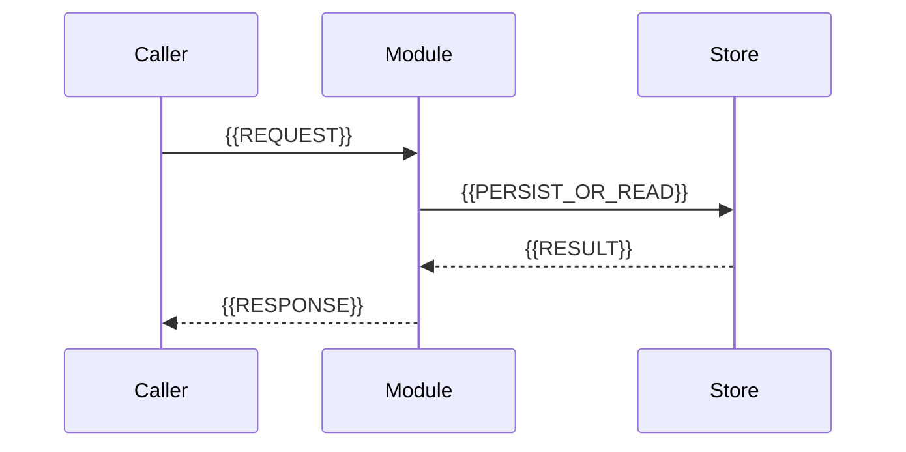
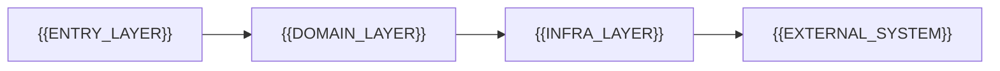

# Mini-Wiki 3.3 模板

这些模板展示 v3 所有权和可移植链接。真实文件由 `mini-wiki build` 创建；Agent 只填充
`mini-wiki:content` 区域，不能复制模板绕过 Manifest 和事务构建。

## 托管页面骨架

```markdown
---
id: mw:document:{{DOCUMENT_KEY}}
title: "{{TITLE}}"
type: {{TYPE}}
domain: {{DOMAIN}}
status: generated
aliases: []
tags:
  - mini-wiki/{{TYPE}}
  - domain/{{DOMAIN}}
sources:
  - {{SOURCE_PATH}}
source_hash: sha256:{{SOURCE_HASH}}
source_count: {{SOURCE_COUNT}}
freshness: current
orphan: false
backlink_count: {{BACKLINK_COUNT}}
quality: basic
mini_wiki_version: 3.3.0
---

<!-- mini-wiki:generated:start -->
# {{TITLE}}

> 由 Mini-Wiki 管理的来源、关系和导航。

## 来源

- [{{SOURCE_PATH}}:{{START_LINE}}-{{END_LINE}}]({{RELATIVE_SOURCE_LINK}}#L{{START_LINE}}-L{{END_LINE}})

## 关系

- 上级：[[{{PARENT_DOCUMENT}}]]
- 相关：[[{{RELATED_DOCUMENT}}]]
<!-- mini-wiki:generated:end -->

<!-- mini-wiki:content:start -->
## 职责与边界

{{EVIDENCE_BASED_EXPLANATION}}
<!-- mini-wiki:content:end -->
```

Properties 中的路径使用仓库相对形式；正文中的源码链接则要从当前 Markdown 文件计算相对路径。

## 项目首页内容区

```markdown
## 项目定位

{{PROJECT_PURPOSE_AND_NON_GOALS}}

## 从哪里开始

| 目标 | 页面 | 适合对象 |
| --- | --- | --- |
| 本地运行 | [[getting-started]] | 新成员 |
| 理解系统边界 | [[architecture]] | 开发与架构人员 |
| 浏览知识图谱 | [[knowledge-map]] | 所有人 |

## 核心路径

{{ONE_EVIDENCE_BACKED_END_TO_END_FLOW}}

## 维护提示

- 先用 `mini-wiki search` 查找概念、模块和源码符号。
- 用 `views/quality.base` 与 `views/orphans.base` 治理质量。
- Canvas 是派生图，不在其中保存唯一事实。
```

## 模块页面内容区

````markdown
## 职责与非职责

{{RESPONSIBILITIES}}

本模块不负责：{{NON_RESPONSIBILITIES}}。

## 入口与公开契约

| 入口/接口 | 输入 | 输出或副作用 | 证据 |
| --- | --- | --- | --- |
| `{{ENTRY_SYMBOL}}` | {{INPUT}} | {{OUTPUT}} | [{{SOURCE_PATH}}:{{LINE}}]({{RELATIVE_SOURCE_LINK}}#L{{LINE}}) |

## 关键流程



图中 `Caller → Module` 由 [{{CALL_SITE}}:{{CALL_LINE}}]({{RELATIVE_CALL_LINK}}#L{{CALL_LINE}}) 证明；
`Module → Store` 由 [{{STORE_SITE}}:{{STORE_LINE}}]({{RELATIVE_STORE_LINK}}#L{{STORE_LINE}}) 证明。

## 状态与生命周期

{{STATE_AND_LIFECYCLE}}

## 失败与恢复

| 条件 | 当前行为 | 恢复/补偿 | 证据 |
| --- | --- | --- | --- |
| {{FAILURE}} | {{BEHAVIOR}} | {{RECOVERY}} | [源码]({{RELATIVE_ERROR_LINK}}#L{{ERROR_LINE}}) |

## 安全、性能与扩展

{{BOUNDARIES_AND_TRADEOFFS}}

## 相关页面

- [[{{PARENT_DOCUMENT}}]]
- [[{{DEPENDENCY_DOCUMENT}}]]
- [[{{CONSUMER_DOCUMENT}}]]
````

## 架构页面内容区

````markdown
## 架构摘要

{{ARCHITECTURE_SUMMARY}}



### 边界依据

- `Entry → Domain`：[{{ENTRY_SOURCE}}]({{RELATIVE_ENTRY_LINK}}#L{{ENTRY_LINE}})
- `Domain → Infra`：[{{DOMAIN_SOURCE}}]({{RELATIVE_DOMAIN_LINK}}#L{{DOMAIN_LINE}})
- `Infra → External`：[{{INFRA_SOURCE}}]({{RELATIVE_INFRA_LINK}}#L{{INFRA_LINE}})

## 端到端流程

{{REQUEST_OR_JOB_FLOW}}

## 状态、错误与可观测性

{{STATE_ERROR_OBSERVABILITY}}

## 演进约束

{{CONSTRAINTS_AND_VERIFICATION_GAPS}}
````

## API 页面内容区

````markdown
## `{{METHOD}} {{ROUTE}}`

{{PURPOSE}}

**实现**：[{{SOURCE_PATH}}:{{START_LINE}}-{{END_LINE}}]({{RELATIVE_SOURCE_LINK}}#L{{START_LINE}}-L{{END_LINE}})

### 身份与权限

{{AUTHORIZATION_BOUNDARY}}

### 请求

| 字段 | 类型 | 必填 | 约束 |
| --- | --- | --- | --- |
| `{{FIELD}}` | `{{TYPE}}` | {{REQUIRED}} | {{VALIDATION}} |

### 响应与副作用

{{SUCCESS_ERROR_AND_SIDE_EFFECTS}}

### 示例

```http
{{METHOD}} {{ROUTE}}
Content-Type: application/json

{{REQUEST_BODY}}
```

示例只使用实现和测试中存在的字段。
````

## Base 模板

Bases 必须是合法 YAML，并从页面 Properties 读取事实。下面是模块视图的最小形态：

```yaml
filters:
  and:
    - file.inFolder("domains")
    - type == "module"
views:
  - type: table
    name: Modules
    order:
      - file.name
      - domain
      - freshness
      - quality
      - backlink_count
```

质量队列可用递归过滤：

```yaml
filters:
  or:
    - quality != "complete"
    - freshness != "current"
views:
  - type: table
    name: Needs review
    order:
      - file.name
      - quality
      - freshness
      - sources
```

实际构建固定生成 `modules.base`、`sources.base`、`quality.base` 和 `orphans.base`，不应手工维护第二份
状态表。

## JSON Canvas 模板

Canvas 使用 JSON Canvas 1.0 的 `nodes` 与 `edges`。ID 必须由稳定仓库标识派生，不能使用随机值：

```json
{
  "nodes": [
    {
      "id": "document-core",
      "type": "file",
      "file": "domains/core/core.md",
      "x": 0,
      "y": 0,
      "width": 400,
      "height": 260
    },
    {
      "id": "source-core-app",
      "type": "text",
      "text": "src/core/app.py",
      "x": 520,
      "y": 0,
      "width": 320,
      "height": 160
    }
  ],
  "edges": [
    {
      "id": "generated-from-core",
      "fromNode": "document-core",
      "toNode": "source-core-app",
      "label": "generated_from"
    }
  ]
}
```

文件节点的 `file` 从 Canvas 所在 Vault 根解析。修改图谱或 Properties 后通过构建重生 Canvas，不直接
修补派生 JSON。

## v3 配置模板

```yaml
schema_version: 3
vault:
  path: wiki
  link_style: wikilink
  source_links: relative-markdown
  preserve_manual_content: true
generation:
  language: zh
  include_diagrams: true
  include_examples: true
  max_file_size: 100000
scan:
  respect_gitignore: true
  exclude:
    - .git
    - .mini-wiki
    - .agents
search:
  enabled: true
  index_code_symbols: true
bases:
  enabled: true
canvas:
  enabled: true
  max_nodes: 200
obsidian:
  integration: auto
```

## 迁移后的接管模板

使用 `mini-wiki migrate --apply --adopt` 时，旧页面整体进入内容区：

```markdown
<!-- mini-wiki:content:start -->
{{LEGACY_DOCUMENT_BYTES_PRESERVED_AS_IS}}
<!-- mini-wiki:content:end -->
```

不要逐段解析再序列化旧内容；保留原文能让迁移可审计、可回退。

## 完成检查

- 内容只进入 Agent 所有区域；
- 源码和 Wiki 链接从当前页面可解析；
- Properties 与图谱事实一致；
- Mermaid 关系有来源说明；
- Bases 只查询统一 Properties；
- Canvas 使用稳定 ID 且所有边端点存在；
- `mini-wiki check --strict` 通过。
